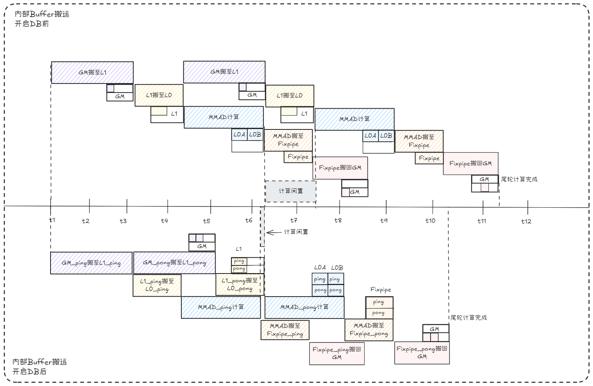
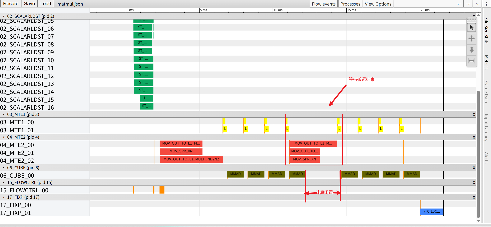
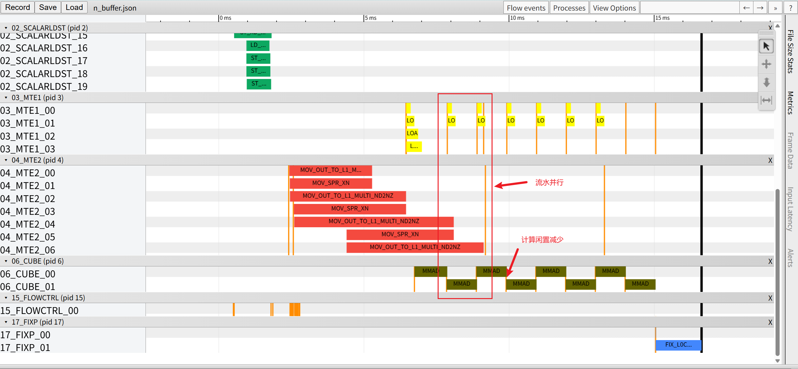

# N-Buffer特性介绍
## 1. 原理介绍
### 1.1 背景
&ensp;&ensp;在NPU（神经网络处理单元）的数值计算中，性能瓶颈往往不在于计算单元本身的处理速度，而在于数据搬运与计算之间的等待延迟。传统编程模式下，数据加载（通常由MTE流水完成）和矩阵计算（由Cube流水执行）采用串行执行方式：计算单元必须等待当前数据块完全加载至片上后才能开始运算；而在计算过程中，数据加载单元又处于空闲状态。这种串行模式导致硬件资源利用率低下，计算流水线上频繁出现“空洞”，严重制约了整体性能。
### 1.2 原理
&ensp;&ensp;N-Buffer 是一种经典的流水线并行优化技术，其核心思想在于通过引入多份缓冲区，实现**数据加载与计算的重叠执行**，从而有效隐藏数据搬移带来的延迟。

&ensp;&ensp;以双缓冲机制为例，通过将芯片内部缓冲区划分为两个独立区域，使得数据搬运与计算任务能够交替进行，避免了因防止数据冲突而引入的等待开销，从而提升了流水线并行度。然而，当数据搬移时间较长或计算粒度较小时，双缓冲机制仍可能出现计算单元空闲、等待数据就绪的情况。

&ensp;&ensp;为进一步隐藏数据搬移延迟，可引入四缓冲机制。四缓冲在双缓冲的基础上将缓冲区数量扩展至四个，构建更深层次的流水线结构，进一步增强数据供给与计算执行之间的解耦能力。在高端 NPU 或对性能有极致要求的场景中，还可根据实际流水级数和访存特性，进一步增加缓冲块数量，以实现更高的资源利用率。

**计算流水图如下**：

<div align="center">
  
</div>

&ensp;&ensp;如图所示，在传统串行模式下，计算单元与搬运单元无法并行工作，导致计算资源频繁空闲，整体效率显著降低。而在Double Buffer双缓冲（下文简称 DB）模式下，当计算单元正在处理缓冲区0中的数据时，数据加载单元可同时将下一块数据预取至缓冲区1中。通过这种“乒乓”式的流水线机制，计算与搬运过程实现完全重叠，流水线持续饱满，硬件利用率得以大幅提升。

&ensp;&ensp;可以在流水图中看到，各级均配置了ping/pong双缓冲区，从而实现“搬运-计算”的无缝重叠。这六个步骤环环相扣，最大限度地提升了硬件利用率。

### 1.3 预期效果
* **隐藏搬运延迟**：计算单元无需等待数据加载，持续满负荷运转。
* **提升硬件利用率**：MTE2和Cube单元并行工作，接近理论峰值性能。
* **减少流水间隙**：消除计算间的等待时间，实现指令级并行。


## 2. 实践：使用DB优化matmul计算流水

### 2.1 代码
以下以一个典型的MatMul计算为例，展示如何改造为DB使能版本。

#### 2.1.1 流水同步事件初始化

&ensp;&ensp;由于 MatMul 计算流水线由流水同步事件严格管控，在循环起始处需等待上一轮数据搬运完成后方可继续执行， 因此需要提前初始化同步事件标志。在串行版本中，仅初始化了单一组事件标志，所有同步操作均依赖同一标志位，导致不同流水阶段之间无法实现独立的并行执行。

&ensp;&ensp;引入DB机制后，可初始化两组独立的事件标志，分别对应 Ping 缓冲区和 Pong 缓冲区。同时，引入 l1PingPong 与 l0PingPong 计数器，用于追踪当前所使用的缓冲区索引，为后续实现乒乓切换机制奠定基础。

串行版本：

```
constexpr static int16_t ZERO_FLAG = 0;
...

// 流水同步事件初始化
AscendC::SetFlag<AscendC::HardEvent::MTE1_MTE2>(ZERO_FLAG);
AscendC::SetFlag<AscendC::HardEvent::M_MTE1>(ZERO_FLAG);

```

DB使能版本：

```
constexpr static int16_t ZERO_FLAG = 0;
constexpr static int16_t FIRST_FLAG = 1;
...

// 初始化变量
uint64_t baseM = 256;
uint64_t l1PingPong = 0;   // L1 ping-pong缓冲区索引
uint64_t l0PingPong = 0;   // L0 ping-pong缓冲区索引
// ... 其他初始化代码

// 流水同步事件初始化（包含两套事件标志）
AscendC::SetFlag<AscendC::HardEvent::MTE1_MTE2>(ZERO_FLAG);
AscendC::SetFlag<AscendC::HardEvent::M_MTE1>(ZERO_FLAG);
AscendC::SetFlag<AscendC::HardEvent::MTE1_MTE2>(FIRST_FLAG);
AscendC::SetFlag<AscendC::HardEvent::M_MTE1>(FIRST_FLAG);

```

#### 2.1.2 将L1数据搬运到L0A/L0B阶段

&ensp;&ensp;串行版本每次搬运操作前，必须等待上一次操作完全结束后方可执行，搬运完成后才能触发下一阶段，整个过程严格串行，硬件资源无法得到充分利用。

&ensp;&ensp;通过引入DB机制，可动态选择对应的事件标志进行等待，使得当前缓冲区的计算与下一缓冲区的数据预加载能够并行执行。每次操作完成后，计数器相应递增，实现 Ping/Pong 缓冲区的循环切换，从而形成连续的流水线结构，有效提升硬件资源利用率。

串行版本：

```
// 等待MTE1搬运完成，触发MTE2启动
AscendC::WaitFlag<AscendC::HardEvent::MTE1_MTE2>(ZERO_FLAG);

// 将L1数据搬运到L0A/L0B
// ... 数据搬运代码

// 标记MTE2搬运完成，触发MTE1启动
AscendC::SetFlag<AscendC::HardEvent::MTE2_MTE1>(ZERO_FLAG);
AscendC::WaitFlag<AscendC::HardEvent::MTE2_MTE1>(ZERO_FLAG);

// ... L0A/L0B搬运至MMAD并计算

// 标记MTE1搬运完成，触发对应L1缓冲区的下一轮MTE2启动
AscendC::SetFlag<AscendC::HardEvent::MTE1_MTE2>(ZERO_FLAG);

```

DB使能版本：

```
// 根据当前L1缓冲区索引等待对应事件
uint64_t l1BufId = l1PingPong & 1;
AscendC::WaitFlag<AscendC::HardEvent::MTE1_MTE2>(l1BufId);

// 将L1数据搬运到L0A/L0B
// ... 数据搬运代码

// 标记MTE2搬运完成，触发对应L1缓冲区的MTE1启动
AscendC::SetFlag<AscendC::HardEvent::MTE2_MTE1>(l1BufId);
AscendC::WaitFlag<AscendC::HardEvent::MTE2_MTE1>(l1BufId);

// ... L0A/L0B搬运至MMAD并计算

// 标记MTE1搬运完成，触发对应L1缓冲区的下一轮MTE2启动
AscendC::SetFlag<AscendC::HardEvent::MTE1_MTE2>(l1BufId);
l1PingPong++;

```

#### 2.1.3 MMAD计算阶段

&ensp;&ensp;串行版本采用单一事件标志控制同步，计算单元必须等待数据准备就绪后方可开始运算，反之数据搬运亦须等待计算完成，二者形成相互等待的阻塞关系，严重制约了并行执行效率。

&ensp;&ensp;相比之下，DB 方法为 L0 层级引入独立的缓冲区索引与事件标志，使 L0 数据的准备与 MMAD 计算能够重叠执行。当一组 L0 数据送入计算单元时，另一组 L0 数据可同步进行预处理，从而进一步深化流水线并行度，显著提升整体执行效率。

串行版本：

```
// 等待MMAD计算完成，触发MTE1启动
AscendC::WaitFlag<AscendC::HardEvent::M_MTE1>(ZERO_FLAG);

// 将L0A/L0B数据送入MMAD进行计算
// ... 数据准备代码

// 标记MTE1搬运完成，触发MMAD启动
AscendC::SetFlag<AscendC::HardEvent::MTE1_M>(ZERO_FLAG);
AscendC::WaitFlag<AscendC::HardEvent::MTE1_M>(ZERO_FLAG);

// 执行矩阵乘加计算
AscendC::Te::Mad(
    MmadAtom<MmadTraits<MmadOperation, MmadTraitDefault>>{},
    tensorL0C, tensorAL0, tensorBL0, para);

// 标记MMAD计算完成，触发下一轮MTE1启动
AscendC::SetFlag<AscendC::HardEvent::M_MTE1>(ZERO_FLAG);
```

DB使能版本：

```
// 根据当前L0缓冲区索引等待对应事件
uint64_t l0BufId = l0PingPong & 1;
AscendC::WaitFlag<AscendC::HardEvent::M_MTE1>(l0BufId);

// 将L0A/L0B数据送入MMAD进行计算
// ... 数据准备代码

// 标记MTE1搬运完成，触发对应L0缓冲区的MMAD启动
AscendC::SetFlag<AscendC::HardEvent::MTE1_M>(l0BufId);
AscendC::WaitFlag<AscendC::HardEvent::MTE1_M>(l0BufId);

// 执行矩阵乘加计算
AscendC::Te::Mad(
    MmadAtom<MmadTraits<MmadOperation, MmadTraitDefault>>{},
    tensorL0C, tensorAL0, tensorBL0, para);

// 标记MMAD计算完成，触发对应L0缓冲区的下一轮MTE1启动
AscendC::SetFlag<AscendC::HardEvent::M_MTE1>(l0BufId);

l0PingPong++;  // 切换L0缓冲区

```

#### 2.1.4 fixpipe搬出数据阶段

&ensp;&ensp;在结果搬出环节，串行等待方式导致其与计算过程无法有效并行。

&ensp;&ensp;相比之下，DB 机制在循环处理结束后，结果搬出操作虽仍可与计算并行执行，从而在一定程度上提升整体性能，但其本质上仍存在串行等待机制，限制了并行效率的充分发挥。

串行版本：

```
// 等待MMAD计算完成，触发fixpipe搬出数据
AscendC::SetFlag<AscendC::HardEvent::M_FIX>(ZERO_FLAG);
AscendC::WaitFlag<AscendC::HardEvent::M_FIX>(ZERO_FLAG);

// 将L0C结果搬回GM
auto copyL0C2GM = AscendC::Te::MakeCopy(AscendC::Te::CopyL0C2GM{});
AscendC::Te::Copy(copyL0C2GM, gmBlockC_, tensorL0C);

// ... 循环处理

// 释放尾轮多余的事件配置
AscendC::WaitFlag<AscendC::HardEvent::MTE1_MTE2>(ZERO_FLAG);
AscendC::WaitFlag<AscendC::HardEvent::M_MTE1>(ZERO_FLAG);
```

DB使能版本：

```
// 等待MMAD计算完成，触发fixpipe搬出数据
AscendC::SetFlag<AscendC::HardEvent::M_FIX>(ZERO_FLAG);
AscendC::WaitFlag<AscendC::HardEvent::M_FIX>(ZERO_FLAG);

// 将L0C结果搬回GM
auto copyL0C2GM = AscendC::Te::MakeCopy(AscendC::Te::CopyL0C2GM{});
AscendC::Te::Copy(copyL0C2GM, gmBlockC_, tensorL0C);
// ... L0C缓冲区切换

// ... 循环处理

// 释放所有事件配置
AscendC::WaitFlag<AscendC::HardEvent::MTE1_MTE2>(ZERO_FLAG);
AscendC::WaitFlag<AscendC::HardEvent::M_MTE1>(ZERO_FLAG);
AscendC::WaitFlag<AscendC::HardEvent::MTE1_MTE2>(FIRST_FLAG);
AscendC::WaitFlag<AscendC::HardEvent::M_MTE1>(FIRST_FLAG);

```

关键改动点：
* **引入双缓冲区**：定义两个缓冲区
* **异步搬运**：在计算当前块的同时，发起下一次搬运
* **乒乓切换**：通过buffId交替使用缓冲区

### 2.2 修改注意点
* **缓冲区大小设置**：需要根据硬件L1/L2缓存大小和算子Tiling参数合理设置，避免数据溢出
* **同步点控制**： 确保流水同步等待先后顺序与预期执行逻辑一致
* **多核场景**： 通过流水ID切换，确保DB与多核并行结合，每个核独立使用双缓冲

## 3 性能结果对比
### 3.1 case前后性能
以基础MatMul算子为例，在相同输入规模（M=512, K=512, N=512）下进行性能测试，通过Profiling工具采集硬件流水线执行状态。
未开启双buffer优化时：



从上图可以看出，在串行执行模式下，计算单元（Cube）与数据搬运单元（MTE2）呈现明显的交替工作状态。当搬运单元加载数据时，计算单元处于空闲等待状态；而当计算单元开始运算时，搬运单元又停止工作。这种“搬-等-算-等”的串行模式导致硬件资源利用率低下，流水线中出现大量空洞，整体执行时间较长。

开双buffer优化结果：



开启DB特性后，硬件流水线状态发生显著变化。计算单元与搬运单元实现高度并行：在Cube单元处理当前数据块的同时，MTE2单元已经开始预加载下一块数据。从图中可以清晰看到，两条流水线几乎完全重叠，流水线空洞大幅减少，硬件资源得到充分利用。最终体现在执行时间上，算子端到端延迟降低约40%，硬件利用率提升至接近理论峰值。

## 4. 结论
适用场景：
* **搬运带宽遇到瓶颈**：当单次计算耗时远小于搬运时，带宽遇到瓶颈，开启db可以有效提升搬运效率。
* **多核并行**： 每个核独立使用DB，整体收益累加

对于是否可以通过开启DB来提升流水并行度，可以先分析Profiling数据，判断当前瓶颈是计算还是搬运。若搬运时间远大于计算，优先尝试DB优化，同时需要结合Tiling策略，确保切分后的Tile大小可以在开启双buffer后不超出硬件资源，多核使用时注意线程同步。
## 5.编译 执行

1. 编译样例

从项目根目录启动构建，参考项目[README.md](../../../README.md)

指定matmul的编译命令：
```shell
cmake --build build --target N_Buffer
```

2. 运行样例

切换到可执行目录文件的所在目录`build/Samples/1_Features/N_Buffer/`, 使用可执行文件直接执行算子用例，需要指定矩阵乘维度，并随机生成输入数据。
```shell
cd ./build/Samples/1_Features/N_Buffer/
N_Buffer 1024 2048 4096
```
打印如下执行结果，证明样例执行成功。
```shell
matmul run successfully!
```
如果存在精度问题，则会打印错误数据，并显示如下结果。
```shell
matmul run failed!
```

## 6. 支持架构

NPU ARCH 3510