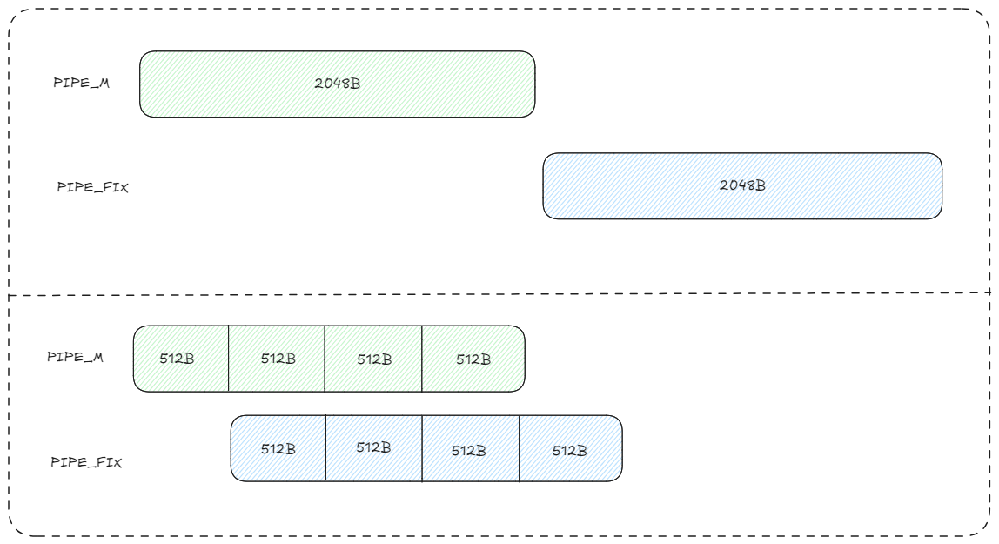
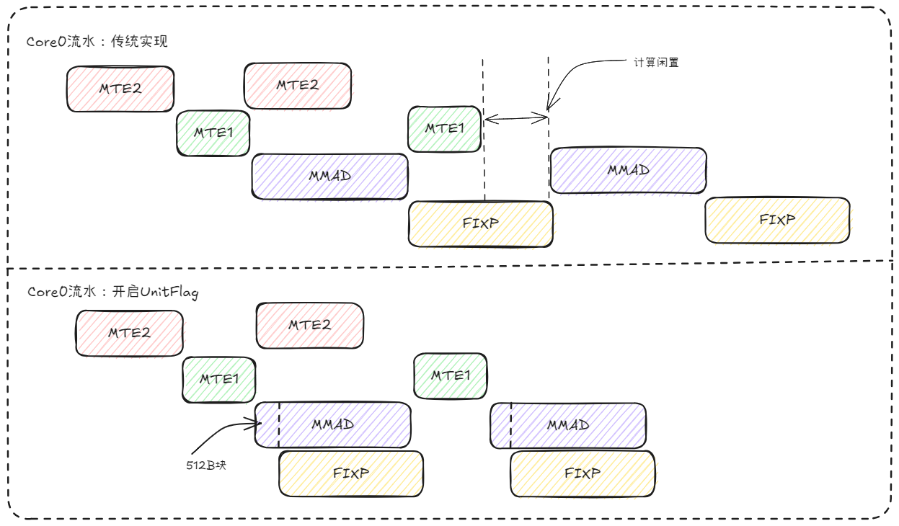
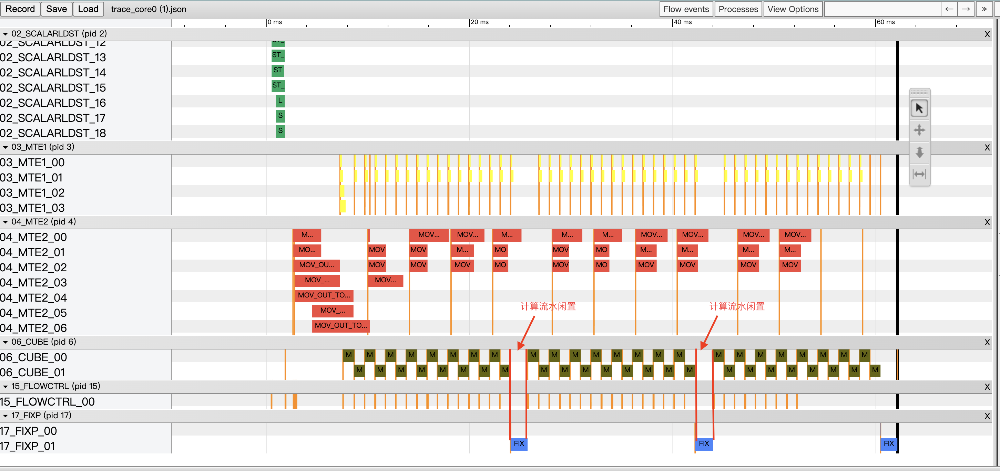
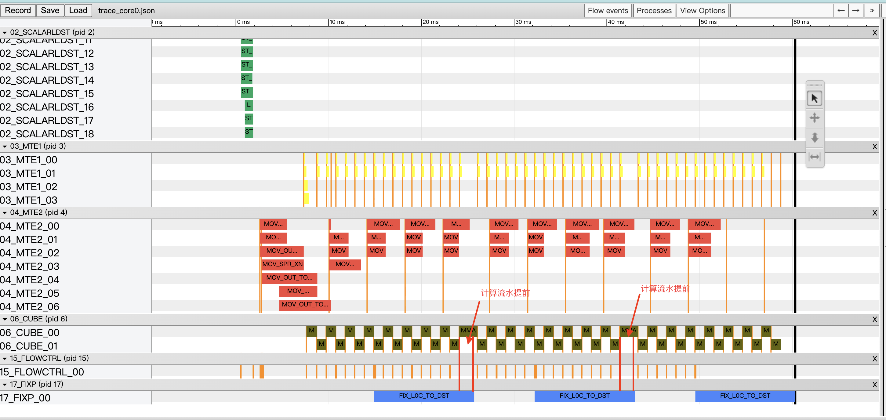
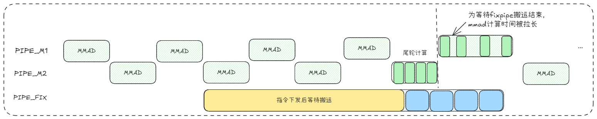

# unitflag特性介绍
## 1. 原理介绍
### 1.1 背景
&ensp;&ensp;在算子性能调优过程中，对于带宽搬运瓶颈引起的计算断流我们要尽力优化，一般从两方面入手，首先是减少片外内存到片内内存的重复搬运，同时提高搬运效率，开启N-Buffer正是为了流水并行进而提高搬运效率，N-Buffer具体原理可以查看专题解说[N-Buffer特性介绍](../n_buffer/README.md)。

&ensp;&ensp;然而N-Buffer特性虽然可以很大限度的提升搬运效率，但是由于为了降低重复搬运数据量，传入计算单元的计算基本块会设计的尽量大，使得L0C缓存块占满，不能开启缓存机制，使得计算流水（MMAD）与搬出流水（Fixpipe）无法并行。基于此昇腾NPU硬件给出了指令级的优化手段，通过对计算和搬出指令参数进行配置，开启unit_flag标志位，使得搬运效率得到进一步的提升。

### 1.2 原理
* **传统计算方式**：计算单元需等待数据完全计算完成后才开始搬运，搬移与计算串行执行，导致计算单元空闲等待。
* **unitflag**：通过合理配置MMAD和FixPipe参数，系统实现计算与搬运的流水线并行。每当计算单元完成一个512b数据块的计算，FixPipe便立即将其搬出，无需等待全部数据搬运完成即可开始下一块数据的计算，从而实现计算与数据搬移的完全重叠执行。

<div align="center">
  
</div>

**计算流水示意图**：

<div align="center">
  
</div>

&ensp;&ensp;UnitFlag通过硬件级流水线调度，实现数据搬出与计算单元操作并行执行。当设置UnitFlag为特定值时，计算指令（如MMAD）无需等待前序搬运完全完成，即可基于缓冲区中已就绪的数据块立即启动计算，后续数据则通过流水线持续供给。这要求软件层面合理切分数据块（Tiling），并协调数据搬运与MMAD计算之间的流水同步，从而最大化隐藏搬运延迟。

### 1.3 预期效果
* **吞吐量提升**：单位时间内完成的有效计算量增加，整体算子性能得到优化。
* **资源利用率优化**：计算单元与搬移单元并行工作，硬件资源得到更充分利用。

## 2. 实践：使用unitflag使能优化matmul计算流水

### 2.1 代码
主要改动点是配置mmad入参和fixpipe重新配置

改造前
```
// 执行 M-MAD 操作
MmadParams para;
para.cmatrixInitVal = (iter1 == 0 && iter0 == 0);
para.m = actualCurM;
para.n = actualCurN;
para.k = curKL0;

AscendC::Te::Mad(
    MmadAtom<MmadTraits<MmadOperation, MmadTraitDefault>>{}, 
    tensorL0C, tensorAL0, tensorBL0, para);

// 流水同步 MMAD计算和Fixpipe搬出指令
AscendC::SetFlag<AscendC::HardEvent::M_FIX>(ZERO_FLAG);  
AscendC::WaitFlag<AscendC::HardEvent::M_FIX>(ZERO_FLAG);  
// 拷贝 L0c 到 GM（默认配置）
auto copyL0C2GM = AscendC::Te::MakeCopy(AscendC::Te::CopyL0C2GM{});
AscendC::Te::Copy(copyL0C2GM, gmBlockC_, tensorL0C);
```

改造后
```
// 新增：单元标志控制开关
constexpr uint32_t UNITFLAG_DISABLE = 0; // 不开启unit_flag  
constexpr uint32_t NO_FINAL_ACCUMULATION = 2; // 非尾轮标志
constexpr uint32_t FINAL_ACCUMULATION = 3; // 尾轮标志

// 执行 M-MAD 操作
MmadParams para;
para.cmatrixInitVal = (iter1 == 0 && iter0 == 0);
para.m = actualCurM;
para.n = actualCurN;
para.k = curKL0;

// 关键改动1：根据迭代位置动态配置 unitFlag
if constexpr (EN_UNIT_FLAG == true) {
    if (iter1 == (kL0IterNum - 1) && iter0 == (kL1TileNum - 1)) {
        para.unitFlag = FINAL_ACCUMULATION;
    } else {
        para.unitFlag = NO_FINAL_ACCUMULATION;
    }
}

AscendC::Te::Mad(
    MmadAtom<MmadTraits<MmadOperation, MmadTraitDefault>>{}, 
    tensorL0C, tensorAL0, tensorBL0, para);

// 关键改动2：删除 MMAD和Fixpipe之间的流水同步

// 关键改动3：使用自定义 FixpipeUnitFlagTrait（内置 unitFlag=3）
auto copyL0C2GM = AscendC::Te::MakeCopy(AscendC::Te::CopyL0C2GM{});
AscendC::Te::Copy(copyL0C2GM, gmBlockC_, tensorL0C, AscendC::Te::FixpipeParams{UNITFLAG_EN_OUTER_LAST});

```

### 2.2 修改注意点
* **mmad计算参数配置**：需注意循环边界处理，最后一块尾块的UnitFlag参数配置与中间块不同。
* **fixpipe参数配置**：需要深入理解UnitFlag值的含义与作用顺序，根据实际场景按需配置

## 3 性能结果对比
### 3.1 case前后性能
&ensp;&ensp;以基础 MatMul 算子为例，在相同输入规模（M=1024, K=2048, N=4096）下进行性能测试，通过 Profiling 工具采集硬件流水线执行状态。

&ensp;&ensp;测试结果表明，开启 unit_flag 优化后，FixPipe 数据搬移流水线与 MMAD 计算流水线实现了深度并行执行，有效隐藏了数据搬移延迟，从而提升了算子的整体执行性能。

未开启unit_flag优化前：

<div align="center">
  
</div>

开启unit_flag优化后：

<div align="center">
  
</div>

&ensp;&ensp;在优化后的时序图中，fixpipe 流水段长度显著增加，其根本原因在于 fixpipe 与 mmad 的流水线解绑。解绑后，fixpipe 的指令下发时机提前，但其对应的数据搬运操作并未同步启动，而是延迟至尾轮计算完成、数据累加结束后才进行实际的数据搬移。下一轮 mmad 计算必须等待 fixpipe 完成数据搬运后方可开始，导致该轮 mmad 的计算等待时间延长，整体流水线出现展宽。
<div align="center">
  
</div>

## 4. 结论

**适用场景**：

* 双缓冲机制下，FixPipe 数据搬出与计算单元串行执行，影响后续核心的输出效率。为避免因缓存资源争用导致的计算流水线停顿，可通过开启 unit_flag 实现搬出与计算的流水并行。

* 硬件指令支持以小数据块为单位批量搬出数据，从而降低搬出延迟，提升流水线整体效率。


&ensp;&ensp;unitflag通过硬件流水线实现搬运与计算并行，在数据切分合理的大规模矩阵运算中可显著提升性能，是优化NPU计算效率的关键特性。
## 5.编译 执行

1. 编译样例

从项目根目录启动构建，参考项目[README.md](../../../README.md)

指定matmul的编译命令：
```shell
cmake --build build --target unit_flag
```

2. 运行样例

切换到可执行目录文件的所在目录`build/Samples/1_Features/unit_flag/`, 使用可执行文件直接执行算子用例，需要指定矩阵乘维度，并随机生成输入数据。
```shell
cd ./build/Samples/1_Features/unit_flag/
unit_flag 1024 2048 4096
```
打印如下执行结果，证明样例执行成功。
```shell
matmul run successfully!
```
如果存在精度问题，则会打印错误数据，并显示如下结果。
```shell
matmul run failed!
```

## 6. 支持架构

NPU ARCH 3510