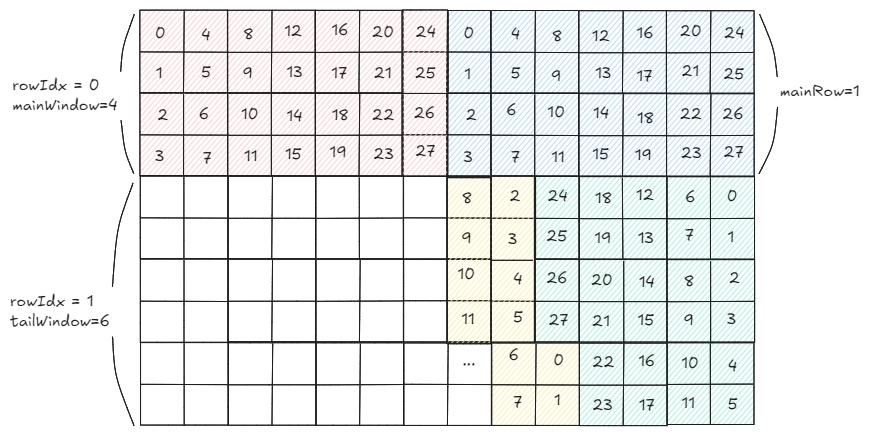
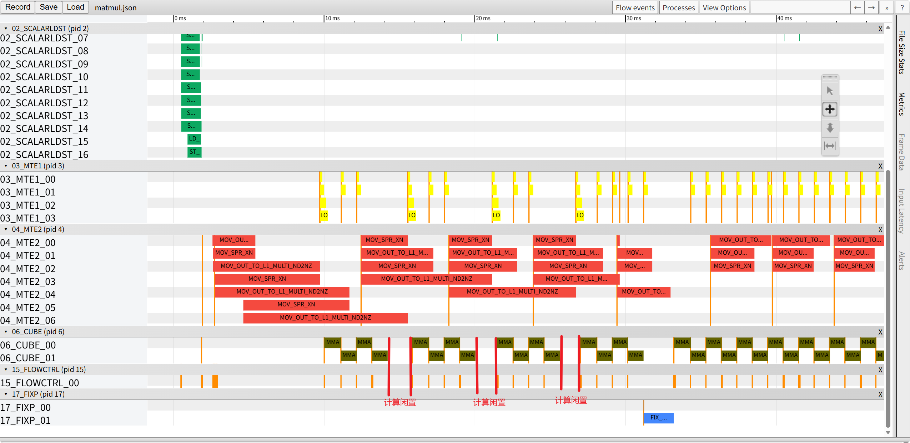
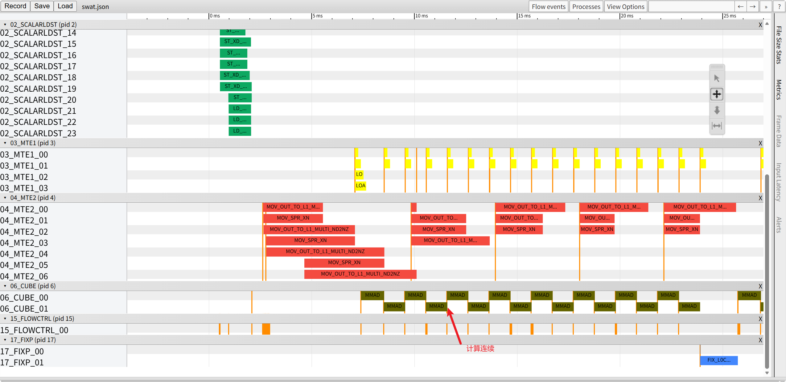

# SWAT(Slide Window Adaptive Template)特性介绍
## 1. 原理介绍
### 1.1 背景
&ensp;&ensp;在性能优化过程中，提升数据搬运效率的关键在于提高L2缓存的命中率。初始搬运阶段，由于数据尚未加载至L2缓存，无法利用缓存进行快速存取，导致该阶段L2命中率较低，搬运速度相对缓慢。随着搬运轮次的增加，数据逐步被缓存，重复搬运时的L2命中率显著提升，搬运效率也随之提高。

&ensp;&ensp;然而，这种搬运效率的分布不均导致早期若干轮次中出现MMAD等待搬运流水的情况，造成计算资源闲置，制约了系统性能的进一步提升。

&ensp;&ensp;针对上述问题，本文引入SWAT（Slide Window Adaptive Template）滑窗模板，旨在通过自适应窗口机制优化搬运过程，均衡流水负载，从而提升整体性能。
### 1.2 原理

&ensp;&ensp;SWAT滑窗模板的核心思想是通过自适应滑动窗口机制，优化多核计算中的数据排布与搬运顺序，从而提升L2缓存的命中率，均衡流水负载。

&ensp;&ensp;具体而言，SWAT将多核计算中每一轮迭代的输出数据按照固定的方正尺寸进行排布，形成规整的数据块网格。在此基础上，设定一个固定大小的滑动窗口，以Z字形顺序在数据网格上滑动访问。

**原理图如下**：

<div align="center">
  
</div>

&ensp;&ensp;如图所示，相较于传统的列优先匹配搬运方式，SWAT滑窗模板的流水分布更加均匀，有效减少了计算资源的闲置时间，整体搬运效率显著提升。

## 2. 实践：使用swat优化matmul计算性能

### 2.1 代码
以一个典型的MatMul计算为例，修改以下代码可实现swat效果：

```
// 初始化swat变量
static constexpr uint64_t WINDOW_LEN = 4UL;
uint64_t mainWindow = WINDOW_LEN < mTileNum ? WINDOW_LEN : mTileNum;
uint64_t mainRow = mTileNum / mainWindow - 1;
uint64_t tailWindow = mTileNum - mainRow * mainWindow;
constexpr int64_t ROWS_PER_CYCLE = 2;

// 多核计算逻辑
for (uint64_t tileIdx = curBlockIdx; tileIdx < tileNum; tileIdx += blockNum) {

    // SWAT：将线性tile索引映射到二维(mTileIdx, nTileIdx)网格。
    // 先完整处理主窗口行，再处理尾窗口。
    // 在奇数行反转nTileIdx，采用蛇形顺序，以提高缓存效率。
    int64_t rowIdx = tileIdx / nTileNum / mainWindow;
    if (rowIdx < mainRow) {
        mTileIdx = rowIdx * mainWindow + tileIdx % mainWindow;
        nTileIdx = (tileIdx / mainWindow) % nTileNum;
    } else {
        rowIdx = mainRow;
        int64_t tailIndex = tileIdx - mainRow * mainWindow * nTileNum;
        mTileIdx = mainRow * mainWindow + tailIndex % tailWindow;
        nTileIdx = (tailIndex / tailWindow) % nTileNum;
    }
    if (rowIdx % ROWS_PER_CYCLE != 0) {
        nTileIdx = nTileNum - 1 - nTileIdx;
    }

    int64_t curM = mTileIdx == (mTileNum - 1) ? tailBaseM : baseM;
    int64_t curN = nTileIdx == (nTileNum - 1) ? tailBaseN : baseN;

    // 单核计算逻辑
    ...
}

```
为避免尾轮尺寸小于滑窗尺寸导致滑窗形状不规整、无法实现最优分配，将尾轮与次尾轮的基本块合并后统一进行滑窗分配顺序，并重新计算滑窗长度。以核数为 28 为例，滑窗分核逻辑示意图如下：

<div align="center">
  
</div>

关键改动点：
* **引入SWAT滑窗机制**：重构 mTileIdx 与 nTileIdx 的计算逻辑，实现滑动窗口效果；同时，通过在奇数行对 nTileIdx 进行反转，完成Z字形滑动访问，提升缓存局部性。

## 3 性能结果对比
### 3.1 case前后性能
&ensp;&ensp;以基础MatMul算子为例，在相同输入规模（M=1024, K=1024, N=8192）下进行性能测试，通过Profiling工具采集硬件流水线执行状态。

&ensp;&ensp;未添加swat机制优化时：

<div align="center">
  
</div>

&ensp;&ensp;swat机制优化结果：

<div align="center">
  
</div>

&ensp;&ensp;从优化效果来看，采用 SWAT 机制后，原先因首轮 L2 命中率较低导致数据搬运效率下降，进而引发搬运时间过长、打断后续 MMA 计算流水的问题得到了有效改善。SWAT 优化显著提升了首轮数据搬运效率，使计算流水保持连续，算子整体计算时间明显缩短。

## 4. 结论
适用场景：

* **大数据量矩阵乘法运算**：需要多次搬运数据，缓存局部性对性能影响显著。
* **列优先访问模式受限的场景**：传统列优先搬运导致早期流水线等待严重，通过Z字形滑窗可平滑搬运负载分布。

&ensp;&ensp;SWAT滑窗模板通过Z字形自适应窗口访问机制，优化多核计算中的数据排布与搬运顺序，显著提升L2缓存命中率，均衡流水负载，在数据量较大且重复访问频繁的计算场景下，可有效减少搬运等待时间，提升整体计算性能。
## 5.编译 执行

1. 编译样例

从项目根目录启动构建，参考项目[README.md](../../../README.md)

指定matmul的编译命令：
```shell
cmake --build build --target swat
```

2. 运行样例

切换到可执行目录文件的所在目录`build/Samples/1_Features/memory_optimization/swat/`, 使用可执行文件直接执行算子用例，需要指定矩阵乘维度，并随机生成输入数据。
```shell
cd ./build/Samples/1_Features/memory_optimization/swat/
./swat 1024 2048 4096
```
打印如下执行结果，证明样例执行成功。
```shell
matmul run successfully!
```
如果存在精度问题，则会打印错误数据，并显示如下结果。
```shell
matmul run failed!
```

3. 测试性能
切换到可执行目录文件的所在目录`build/Samples/0_Introduction/matmul/`,使用msprof工具执行算子用例，指定矩阵乘维度后执行。
```shell
msprof ./matmul 1024 2048 4096
```
运行完成后，在 `PROF_{序号}_{时间信息}CJEMEBCM/mindstudio_profiler_output/` 目录下获取 `op_summary_{时间信息}.csv` 文件，查看统计耗时以评估性能。

## 6. 支持架构

NPU ARCH 3510