# MatMul算子性能优化实践与效果分析

## 引言

**矩阵乘法**是神经网络和大模型的“底层计算引擎”，从特征传递到注意力机制实现，再到大规模参数运算，所有核心流程都依赖其完成。没有矩阵乘法就无法支撑模型的高效运行与规模突破。

**表 1**  主流网络中矩阵乘法的开销占比


| **网络类型**    |    **核心矩阵乘法占比**   | **主要瓶颈来源**|
|-----------------|--------------|---------------|
|  全连接网络（FCN）  |   95%+    | 几乎全部为线性层，无卷积/注意力等操作。 |
|   Transformer/LLM   |     80%~95%  | 注意力机制和FFN中的矩阵乘法。 |
|   CNN（ResNet等）   |      60%~85%    | 卷积操作（本质为局部矩阵乘）。 |
| 轻量网络（EfficientNet-Lite） |    40%~60%     | 拆分结构多，低维操作，非线性操作占比高。 |

矩阵乘法的性能（运算速度、内存效率、精度）直接决定了网络的 "运行效率" 和"落地能力"。

本文**以Atlas A2 训练系列产品/Atlas A2 推理系列产品为例**，介绍如何在NPU上实现高性能矩阵乘法，一般需关注以下几方面：

- 任务调度与多核并行：实现多核并发计算、任务分割（tile分块）。
- 内存带宽优化：利用本地缓存（如L1/L2）减少全局内存的访问；采用数据预加载、数据压缩和重用策略。
- 核内流水线排布：构建pipeline流水线，提高执行单元并行效率和资源利用率。
- 硬件特性适配：内置专用的矩阵计算单元，针对深度神经网络中的矩阵乘法（如卷积、全连接层）进行加速，显著提升AI模型的训练和推理速度。利用硬件preload、unitflag机制等。

## NPU架构基础知识

### 抽象硬件架构

AI Core是AI处理器的计算核心，AI处理器内部有多个AI Core。本章将介绍AI Core的并行计算架构抽象，如下图所示，该抽象架构屏蔽了不同硬件之间的差异。使用Ascend C编程时，基于抽象硬件架构可以简化硬件细节，显著降低开发门槛。如需了解更详细的硬件架构信息或原理，请参考下文[基本架构](#基本架构)。

**图 1**  抽象硬件架构 <a name="image1"></a>

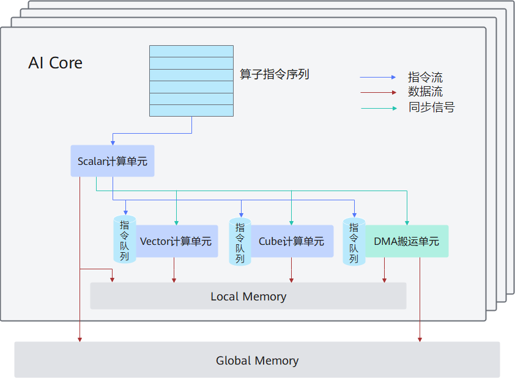


AI Core中包含**计算单元、存储单元、搬运单元**等核心组件。

- 计算单元包括了三种基础计算资源：Cube计算单元、Vector计算单元和Scalar计算单元。
- 存储单元包括内部存储和外部存储：
  -   AI Core的内部存储，统称为Local Memory，对应的数据类型为LocalTensor。
  -   AI Core能够访问的外部存储称之为Global Memory，对应的数据类型为GlobalTensor。

- DMA（Direct Memory Access）搬运单元：负责数据搬运，包括Global Memory和Local Memory之间的数据搬运，以及不同层级Local Memory之间的数据搬运。

AI Core内部核心组件及组件功能详细说明如下表。

<table><thead>
  <tr>
    <th>组件分类</th>
    <th>组件名称</th>
    <th>组件功能</th>
  </tr></thead>
<tbody>
  <tr>
    <td rowspan="3">计算单元</td>
    <td>Scalar</td>
    <td>执行地址计算、循环控制等标量计算工作，并把向量计算、矩阵计算、数据搬运、同步指令发射给对应单元执行。</td>
  </tr>
  <tr>
    <td>Vector</td>
    <td>负责执行向量运算。</td>
  </tr>
  <tr>
    <td>Cube</td>
    <td>负责执行矩阵运算。</td>
  </tr>
  <tr>
    <td>存储单元</td>
    <td>Local Memory</td>
    <td>AI Core的内部存储。</td>
  </tr>
  <tr>
    <td>搬运单元</td>
    <td>DMA（Direct Memory Access）</td>
    <td>负责数据搬运，包括Global Memory和Local Memory之间的数据搬运以及不同层级Local Memory之间的数据搬运。</td>
  </tr>
</tbody>
</table>

开发者在理解硬件架构的抽象时，需重点关注**异步指令流、同步信号流**、**计算数据流**三个过程：

- AI Core内部异步并行计算过程：Scalar计算单元读取指令序列，并将向量计算、矩阵计算、数据搬运指令发射给对应单元的指令队列，向量计算单元、矩阵计算单元、数据搬运单元异步的并行执行接收到的指令。该过程可参考[图1](#image1)中蓝色箭头所示的指令流。

- 不同指令间可能存在依赖关系，为保证不同指令队列间的指令按正确逻辑关系执行，Scalar计算单元也会给对应单元下发同步指令。各单元之间的同步过程可参考[图1](#image1)中绿色箭头所示的同步信号流。

- AI Core内部数据处理的基本过程：DMA搬入单元将数据从Global Memory搬运到Local Memory，Vector/Cube计算单元完成数据计算，并将计算结果写回Local Memory，DMA搬出单元将处理好的数据从Local Memory搬运回Global Memory。该过程可参考[图1](#image1)中红色箭头所示的数据流。

### 基本架构

以Atlas A2系列产品为例，硬件架构如下，本文只介绍关键模块，更多介绍请参考[《Ascend C算子开发》](https://hiascend.com/document/redirect/CannCommunityOpdevAscendC)中关于硬件实现相关的内容。


 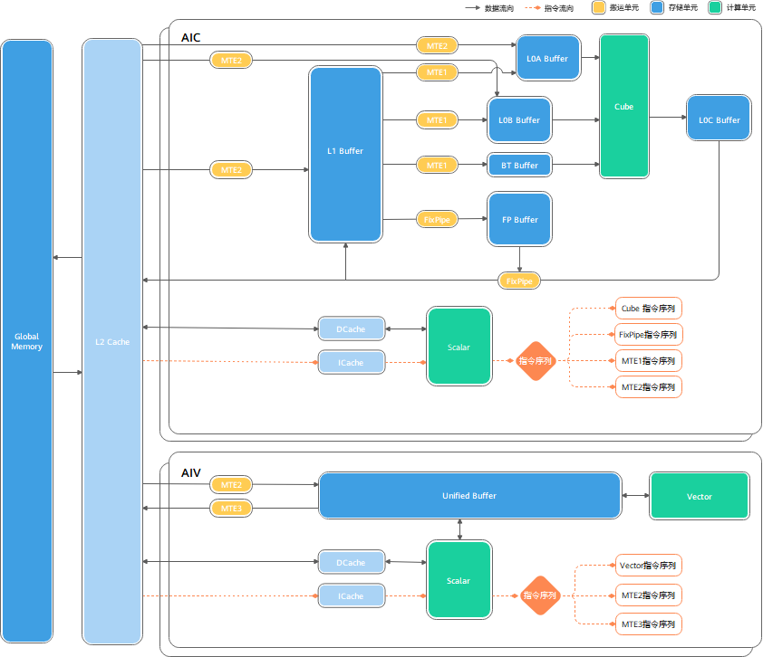


-   **计算单元**

    计算单元是AI Core中提供强大算力的核心单元，包含AIC和AIV两个独立的核，每个核有独立的Scalar，能独立加载代码段并执行。AIC与AIV的配比可以配置为1:1或1:2。此外，AIC包含FixPipe单元，支持随路格式转换和部分随路计算（如Bias累加、量化、激活等）。

-   **存储单元**
    -   GM（Global Memory）：外部数据存储区。
    -   L2 Cache：Cube或Vector计算，外部输入数据缓存区。
    -   L1 Buffer：矩阵计算，输入数据缓存区。
    -   UB Buffer：Vector计算，向量输入/输出缓存区。
    -   BT Buffer：存放矩阵计算中Bias数据，Cube随路Bias使用。
    -   FB Buffer：存放量化、激活类参数，FixPipe随路计算使用。
    -   L0A Buffer：Cube计算，A矩阵输入。
    -   L0B Buffer：Cube计算，B矩阵输入。
    -   L0C Buffer：Cube计算，C矩阵输出。

-   **各存储单元推荐使用的数据排布格式**
    -   L0A Buffer、L0B Buffer和L0C Buffer分别推荐采用以下分形格式（以Atlas A2 训练系列产品/Atlas A2 推理系列产品为例）：

        -   L0A Buffer：FRACTAL\_ZZ
        -   L0B Buffer：FRACTAL\_ZN
        -   L0C Buffer：FRACTAL\_NZ

        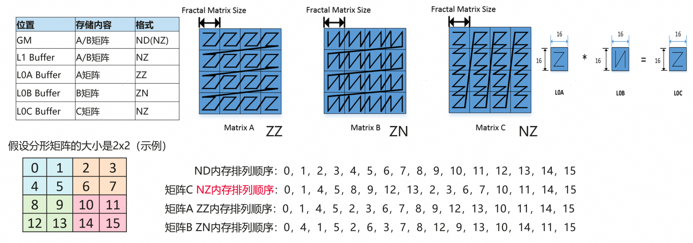

        这些格式针对矩阵乘法等计算密集型任务进行优化，通过将矩阵划分成一些分形（Fractal Matrix），分形shape为16 x \(32B / sizeof\(AType\)\)，Cube计算一个cycle执行16 \* 16 \* 16个乘加运算，重排数据可以连续读取，硬件计算更加亲和，可显著提升计算效率。

    -   L1 Buffer缓存推荐使用FRACTAL\_NZ格式。

        当L1 Buffer采用NZ格式时，数据搬运到L0A/L0B Buffer（需分别转换为ZZ和ZN格式）时，可降低格式转换开销。

    -   Unified Buffer对数据格式没有要求。

## MatMul算子纯Cube场景编程实践

### 核心公式与瓶颈判断逻辑

-   **核心公式**
    1.  算术强度（Arithmetic Intensity）公式如下，即浮点运算次数（FLOPs）/ 移动的数据量（Bytes Moved），用于衡量计算任务中“计算”与“数据传输”的比例。

        

    2.  分析计算任务的时间瓶颈，分别从“计算耗时”和“内存传输耗时”角度评估性能限制，核心逻辑如下：

        

        

        -   计算耗时（T<sub>cal</sub>）
            -   含义：假设计算资源完全利用时，完成所有浮点运算所需的理论时间。
            -   硬件的计算能力上限（单位：FLOPs / 秒），如NPU的计算能力上限为FLOPs / 核数 \* 频率 \* 每个周期运算数。

        -   内存传输耗时（T<sub>mem</sub>）
            -   含义：假设内存传输无阻塞时，完成所有数据读写所需的理论时间。
            -   内存系统的数据传输能力上限（单位：Bytes / 秒），数据量 / 综合传输带宽率。

-   **瓶颈判断逻辑**

    通过比较T<sub>cal</sub>和T<sub>mem</sub>，可确定任务受限于计算还是内存：

    -   当T<sub>cal</sub>≥T<sub>mem</sub>时：任务是计算瓶颈（Compute-bound），提升计算能力可显著加速。
    -   当T<sub>mem</sub>\>T<sub>cal</sub>时：任务是内存瓶颈（Memory-bound），优化内存带宽更有效。

**硬件的 "内存带宽 / 计算带宽" 比值**决定了其对算术强度的 "门槛"，高于门槛的任务更能发挥硬件计算能力，低于门槛则受限于内存。

矩阵计算总耗时受计算耗时，数据搬运耗时影响，本文将围绕**减少计算耗时、数据搬运耗时及总耗时**，介绍昇腾NPU上实现矩阵乘的编程模型，包括多种Tiling算法和Schedule算法等，并介绍如何充分利用NPU属性实现性能最优的方法。

### 降低计算耗时

#### 负载均衡

-   **理论分析**

    昇腾Cube计算单元负责执行矩阵运算，一个核可以在1个时钟周期处理完FP16的16 \* 16 \* 16的矩阵乘加运算，即Fp16算力理论值计算方式：2（乘加） \* 16 \* 16 \* 16  \*  **AI核数**  \* 频率。

    通过启动更多的核同时计算，可提高计算并行度，充分发挥算力。

    

    

    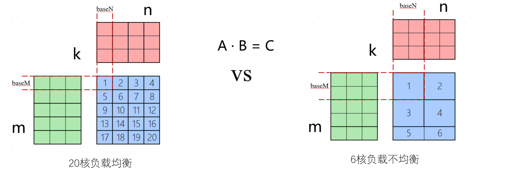

-   **代码实践**

    ```cpp
    for mDim               // mDim = mValue / baseM
      for nDim             // nDim = nValue / baseN
      // mDim * nDim次循环分别调度到不同的核并行计算
      {
          // 单核内计算处理
          for mSingleCore / mL1           //mSingleCore=baseM=mL1
              for nSingleCore / nL1       //nSingleCore=baseN=nL1
                  for kSingleCore / kL1
                      Load aL1
                      Load bL1
                      for kL1/baseK
                          Load aL0
                          Load bL0
                          mmad
                  Fixpipe
      }
    ```

    mDim\*nDim次循环分别调度到不同的核并行计算，负载均衡的调用通常会获得更大收益。

### 降低搬运量

#### 优化分块逻辑

-   **理论分析**

    

    以FP16为例，计算公式如下:

    

    减少数据搬运量，可增加baseM、baseN大小，由于**baseM、baseN受限于L0C Buffer**： baseM \* baseN \* 4Byte ≤ 核输出buffer空间，因此最优baseM=256，baseN=128（baseM=128，baseN=256，内轴对齐256B）。

-   **代码实践**

    ```cpp
    for mValue / 256
        for nValue / 128
        {
            for kSingleCore / kL1
                Load aL1
                Load bL1
                for kL1/baseK
                    Load aL0
                    Load bL0
                    mmad
            Fixpipe
        }
    ```

#### 全载模版

-   **理论分析**

    当MatMul算子左、右矩阵输入存在一路输入较小，而另一路输入较大的场景时，可使能左、右矩阵全载模板，减少小size输入的重复数据搬运。

    

    **全载性能收益点**：

    -   不分核全载时，aL1驻留L1，减少重复载入，主要适用于增量场景。
    -   aL1提前载入，不依赖MM API初始化，一定程度上减少软件头开销。
    -   aL1全载不需要经过L2，可使能disableCache，降低数据搬运Latency。

-   **代码实践**

    常规模板伪代码如下：

    ```cpp
    for mDim
        for nDim
            for kSingleCore / kL1
                Load aL1
                Load bL1
                for kL1/baseK
                    Load aL0
                    Load bL0
            Fixpipe
    ```

    -   以左矩阵不分核全载为例

        ```cpp
        for nDim
            Load aL1
            for kSingleCore / kL1
                Load bL1
                for kL1/baseK
                    Load aL0
                    Load bL0
            Fixpipe
        ```

        **性能收益点**：不分核全载场景，即M方向不分核；理论上左矩阵仅需从HBM搬运一次，其余核走L2复用；右矩阵无重复搬运，全部从HBM搬运；FP16不分核全载场景基本为MTE2 bound。

    -   以左矩阵分核全载为例

        ```cpp
        for mDim
            for nDim
                Load aL1
                for kSingleCore / kL1
                    Load bL1
                    for kL1/baseK
                        Load aL0
                        Load bL0
                Fixpipe
        ```

        **性能收益点**：分核全载场景，即左矩阵无法一次全部载入aL1时，M方向参与分核后，左矩阵K方向单核内可满足仅需从HBM搬运一次，其余核走L2复用。


#### 切K模板

-   **理论分析**

    

    MTE2 bound情况下，增加singleCoreN和singleCoreM，减少重复搬运，可提升并行度。在普通模板多核并行时切分M轴、N轴的基础上，增加核与核之间对K轴的切分。

    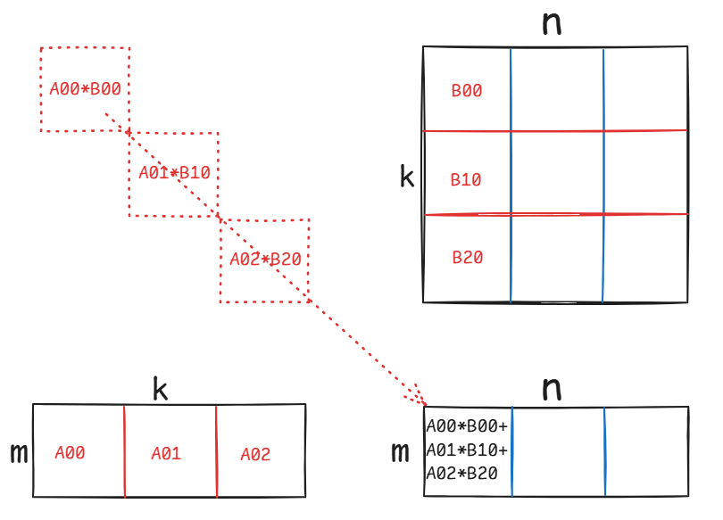

-   **确定性切K计算**

    保证K轴切分时，核与核之间的累加顺序恒定相同，将基本块搬运到UB上逐次累加（保存到GM中，启用AIV核搬运数据到UB上，在UB中完成逐次累加）。

    如上所述，通过atomic实现的多核切K再累加可能存在确定性问题（即相同case多次执行后结果存在不一致）。因此，在L0C搬移到workspace过程中，不能直接使用atomic完成累加，而是在单核内K轴累加后整体搬移到workspace（workspace按核数开辟，并非一份）。在UB上，需要先完成多核累加，再完成cast和removepad。

    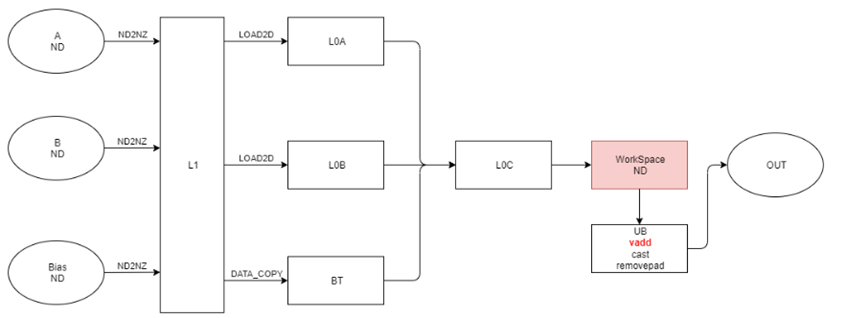

-   **代码实践**

    ```cpp
    //切K代码示例
    tileNum = Div(m, baseM) * Div(n, baseN) * Div(k, baseK);
    if ASCEND_IS_AIC {
        for (int64_t tileIdx = curBlockIdx; tileIdx < tileNum; tileIdx += usedCoreNum) {
            for (uint64_t iter0 = 0; iter0 < curKL1Iter; ++iter0) {
                CopyInA1();
                CopyInB1();
                for (uint64_t iter1 = 0; iter1 < kL0Iter; ++iter1) {
                    CopyInA2();
                    CopyInB2();
                    Mmad();
                }
                CopyOut();
            }
        }
    }
    if ASCEND_IS_AIV {
        DataCopyPad<>();
        for (uint64_t i = 1; i < Div(k, baseK); ++i) { // 在ub上按序累加
            Add();
        }
        DataCopyPad<>();
    }
    ```

    以shape为\(\(32, 4096\), \(4096, 32\)\)矩阵切K为例：

    -   切K前：若使用普通代码逻辑，运行耗时需要12.17us。

        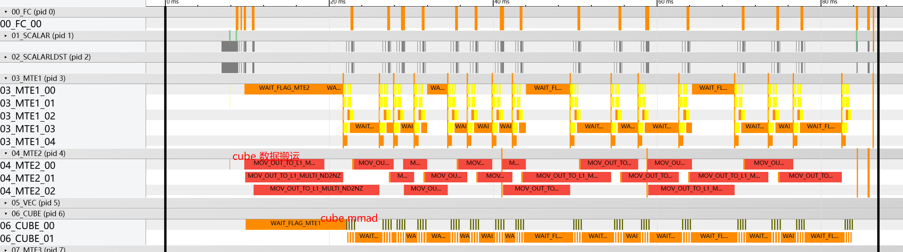

    -   切K后：采用切K模板代码逻辑，运行耗时需要8.44us。

        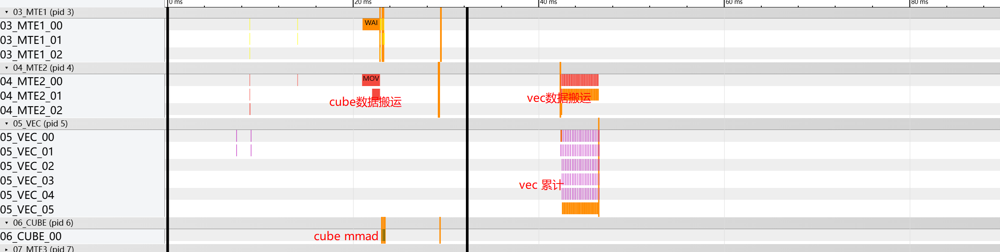


### 提升搬运带宽

#### 提升L2命中率

-   **理论分析**

    根据AI处理器的规格可知，L2带宽速率是HBM的4\~5倍。因此访问同样数据量的情况下，L2的占比越高，整体带宽就越高，更容易满足MMAD计算速率要求。然而，由于L2 Cache的空间有限（192MB），当输入矩阵超过L2 Size时，新搬入的数据会替换旧数据，导致重新读取旧数据时需要再从HBM获取。

    MatMul计算依赖左、右矩阵循环读取，当输入超L2 Size时会遇到L2数据被置换剔除，导致整体L2命中率下降，带宽效率降低，出现流水断流。

    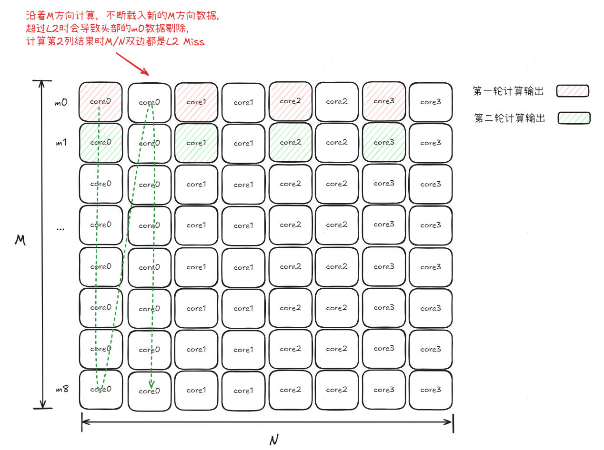

    为提升这类场景的L2命中率，可将单轮计算设计的输入矩阵限制在L2 Buffer Size内，并在多轮计算之间采用“Z”型循环展开遍历，实现数据更换中至少单边数据可复用，提高整体L2命中率。

    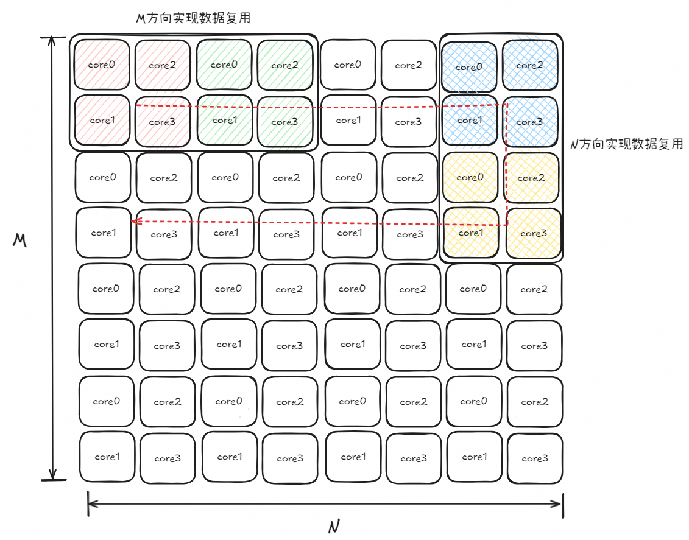

-   **代码实践**

    ```cpp
    for (uint64_t mTileIndex = 0; mTileIndex < block_.params_.mTileCntL2; mTileIndex++) {
        reverse = !reverse;
        for (uint64_t nTileIndexTemp = 0; nTileIndexTemp < block_.params_.nTileCntL2; nTileIndexTemp++) {
            uint64_t nTileIndex = reverse ? (block_.params_.nTileCntL2 - nTileIndexTemp - 1) : nTileIndexTemp; // 换行反向循环，实现“Z”型遍历
            block_.UpdateBlockCnt(mTileIndex, nTileIndex);
            block_.InitBlockIndex(index);
            for (uint64_t j = 0; j < block_.params_.realRound; j++) {
                mm_.SetSingleShape(block_.params_.singleCoreM, block_.params_.singleCoreN,
                    block_.matmulTilingData_->matmulTiling.singleCoreK);
                mm_.SetTensorA(aGlobal_[block_.offset_.offsetA], block_.params_.isTransposeA);
                mm_.SetTensorB(bGlobal_[block_.offset_.offsetB], block_.params_.isTransposeB);
                mm_.SetBias(biasGlobal_[block_.offset_.offsetBias]);
                mm_.Iterate();
                mm_.GetTensorC(cGlobal_[block_.offset_.offsetC], enAtomic);
            }
        }
    }
    ```

#### 数据NZ预处理

##### 训练：使用AIV做ND2NZ

-   **理论分析**

    对于Atlas A2 训练系列产品/Atlas A2 推理系列产品，内轴非256B对齐时，随路ND2NZ指令的搬运效率非常低，导致搬入带宽很低，远低于理论值，MTE2 bound严重。

    以如下case为例，dtype=float16，Atlas A2 训练系列产品/Atlas A2 推理系列产品的性能如下：

    | shape | 总耗时(us) | MTE2耗时(us) | FIXP耗时(us) |
    | ----- | ---------- | ------------ | ------------ |
    |  (80000, 5)，(5, 1024)  |   606.2   |   551.43  | 553.72|

    从Profiling性能数据可以看出，MTE2和FIXP（FixPipe）占比很高。根据载入量和耗时，计算实际输入和输出带宽：

    -   数据总载入量：80000\*1024\*5\*\(1/128+1/256\)\*2 = 9600000Bytes，约为9.16MB。
    -   综合输入带宽：9600000/1000/1000/551.43 =  **0.017TB/S**，只有理论峰值带宽的**0.9%**。
    -   输出shape：\(m, n\)=\(80000, 1024\)。
    -   输出带宽：80000\*1024\*2/1000/1000/553.72 =  **0.3TB/S**。

    可见输入和输出带宽与理论值差距很大。

    -   问题一：对于输入，由于左矩阵内轴为5，只有10B，使用随路ND2NZ指令时，存在严重的小包搬运以及指令内部问题，导致带宽效率非常低。
    -   问题二：对于输出，输出内轴为1024，为512B对齐场景，且每个核切分后也是512B对齐，这属于AI处理器亲和场景，理论上输出带宽不应这么低。出现FixPipe耗时较长的原因：①启用了unitflag（MMAD指令和FIXP指令Block级同步），计算耗时影响了FixPipe数据呈现；②MTE2输入效率低，导致带宽抢占，使得输出带宽变低。

    **总结**：主要瓶颈点在于MTE2，内轴太小，导致ND2NZ指令效率极低。

    **优化思路**：不使用随路ND2NZ指令，通过AIV核，先将数据从GM搬到UB，再通过AIV指令完成ND转NZ，然后AIC核直接读取NZ数据进L1，提升带宽效率，降低端到端耗时。

    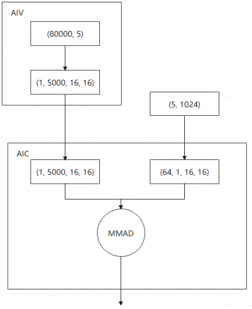

    **数据从GM搬到UB有2种方案**：

   -   方案一：使用DataCopyPad指令逐行搬运，配置burstlen=D\*sizeof\(dtype\)和nburst，完成数据搬运，再使用vcopy进行数据重排，最后搬出。

        优点：规避了随路ND2NZ的问题，代码实现简单，能高效发挥HBM带宽。

        缺点：逐行搬运，burstlen=D\*sieof\(dtype\)，若D较小，该指令无法最大程度发挥带宽效率。

    -   方案二：将外轴切分并与内轴合并，再使用DataCopyPad指令，大块连续搬运到UB，两次调用vnchwconv指令完成数据重排，最后搬出。

        优点：若D较小，burstlen可设置比较大，能最大程度发挥HBM带宽。

        缺点：代码实现复杂，vnchwconv指令更容易造成bank冲突。

    **针对不同场景，方案如下：**

    -   内轴非256B对齐的场景，使用AIV完成ND2NZ的数据重排。
    -   内轴大于512B时，使用方案一，即DataCopyPad逐行搬运+vcopy进行数据重排。
    -   内轴小于512B时，使用方案二，即DataCopyPad合轴搬运+vnchwconv进行数据重排。


- **代码实践**

    合轴搬运：对于\(m, k\)内轴非对齐，目标是变为\(k1, m\_align16, c0\)，算法分为四个阶段：CopyIn、TransposeIn、TransposeOut、CopyOut，详情参考[《Ascend C算子开发》](https://hiascend.com/document/redirect/CannCommunityOpdevAscendC)。

    1.  **CopyIn**

        算法将输入矩阵分为多个基本块处理，不足部分视为整块处理，分块大小需考虑非对齐部分与c0的整除关系。

        基本块大小为\(16\*c0/gcd\(k, 16\), k\)，gcd为最大公约数。举例1：k=15（fp16场景），基本块大小\(256, 15\)；举例2：k=12（fp16场景），基本块大小\(64, 12\)；举例3：k=10（fp32场景），基本块大小\(64, 10\)，这样获得的基本块是能够完整转置并补零的。

        每次Copy基本块的整数倍，大小取决于UB大小，并且需要考虑到后面几个部分需要的内存空间，尽可能使用较大的块传入。

    2.  **TransposeIn**

        利用vnchwconv指令将块\(16\*n\*m0/16, k\)转置为\(n\*m0/16\*k，16\)，m0为基本块的高度c0/gcd\(k, 16\)，公式保证m0\*k/16为整数而且可以被c0整除。

        输入排布如下：

        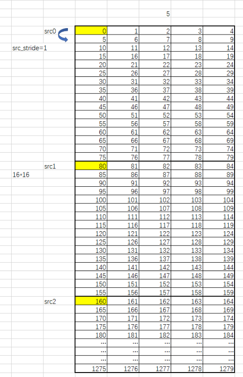

        输出排布如下：

        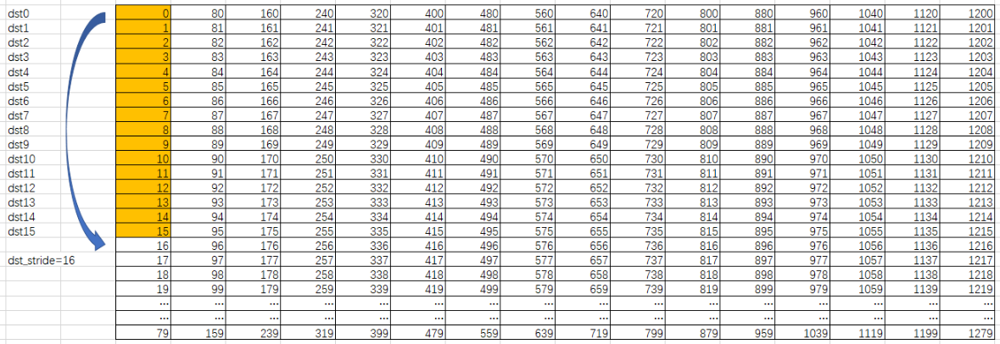

    3.  **TransposeOut**

        由于vnchwconv可以任意选择16个输入指针的位置，可以申请一块UB空间，并将其赋值为0，让其为转置操作补充0行。（进一步的优化方法：无效数据不做填0操作，mad时只做有效数据的计算）

        输入排布如下：

        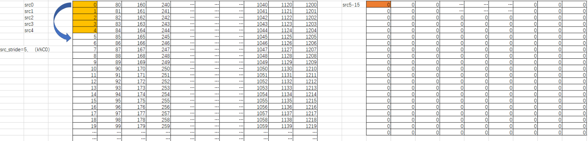

        输出排布如下：

        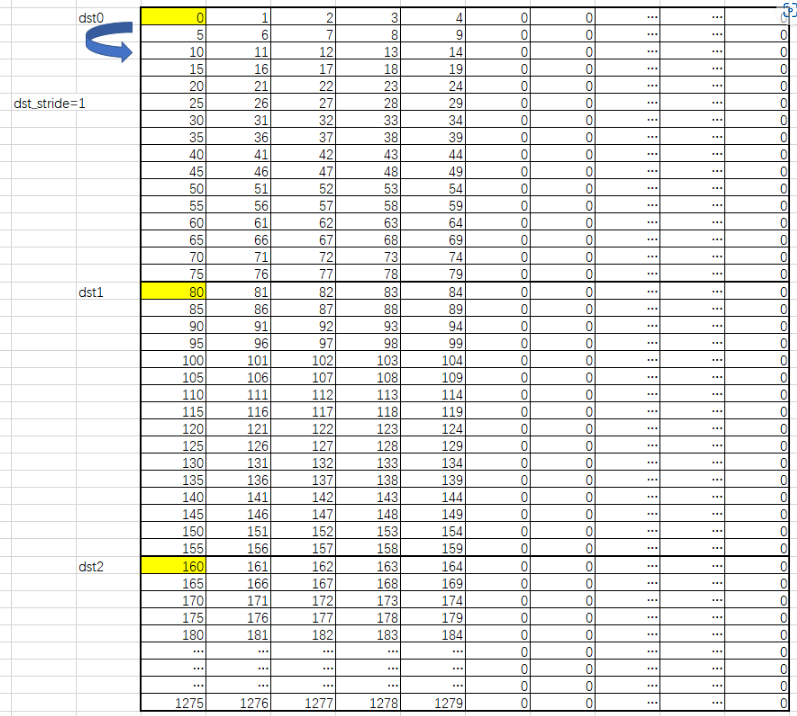

    4.  **CopyOut**：最终将NZ结果搬到workspace。

- **测试效果**

    |  优化方法 |   总耗时(us) |  AIC_MTE2耗时(us) |  AIV_MTE2耗时(us)  | AIV实际带宽(TB/S) |  综合输入带宽(TB/S)|
    |-----------|-----------|----------|-----------|------|-------|
    |  随路ND2NZ  | 606.2   |     551.43   |    0    |   0   |   0.017|
    | 方案一    |  193.02   |    17.751  |   76.835  |   0.01   |   0.11|
    |方案二    |  116.78   |  20.372   |   7.148  |   0.11 |   0.38|

    对比可见：使用AIV做ND2NZ，规避随路ND2NZ指令不亲和场景后，使用方案一，综合输入带宽提升了6.5倍，case性能提升了68%；而使用方案二，性能可再提升40%。

    对于内轴非512B对齐的场景，随路ND2NZ指令带宽利用率低，影响算子性能，可通过AIV进行ND2NZ的重排。当内轴小于512B时，可通过合轴搬运进一步提升带宽利用率，从而提升算子整体性能。该优化方法对于BatchMatMul算子同样适用。

    限制1：带宽利用率与数据量有关，如果矩阵数据总量太小，即使走AIV也无法明显提升有效带宽，反而因为引入了AIV计算和多核同步导致端到端性能劣化。

    限制2：vnchwconv指令容易造成ub bank冲突，需要考虑如何减少bank冲突，减少aiv数据重排耗时，达到最优性能。

##### 推理：Weight NZ预处理

-   **理论分析**

    NPU内部使用硬件亲和的数据排布格式FRACTAL_NZ（简写NZ格式），MatMul使用传统排布ND传入时，会随路进行格式转换，转换过程中存在一定带宽损失。因此在推理场景中，可以对权重进行预处理转换成NZ排布，充分发挥带宽利用率。

    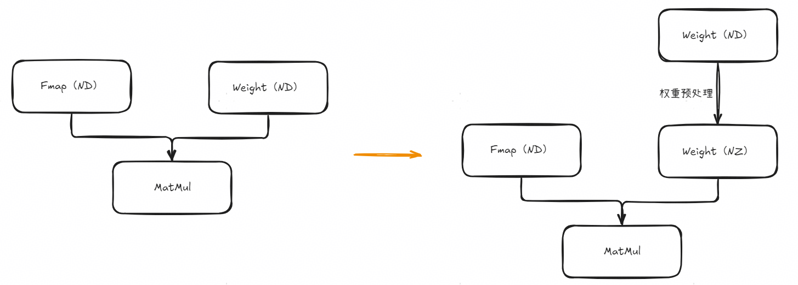

    该方法仅适用于推理场景，训练场景由于无法对权重预处理，实际ND转NZ的操作会引入额外耗时。

-   **代码实践**

    ```python
    import torch
    import torch_npu

    weightNz = torch_npu.npu_format_cast(B, 29);
    output = torch.matmul(fmap, weightNz);
    ```

-   **测试效果**

    基于典型客户网络验证效果：全量场景提升10%，增量场景提升13%。

#### 冲突类的优化

- **理论分析**

    每个channel包含多个bank，但同一bank无法同时处理多个请求（需先关闭当前行才能访问新行）。冲突场景：若多个请求访问同一channel的同一bank，需排队处理，导致bank conflict，影响数据搬运。传统的按照行/列优先分核的方式，会导致单边多核冲突过多而影响数据搬运效率，导致整体搬运效率较低。

    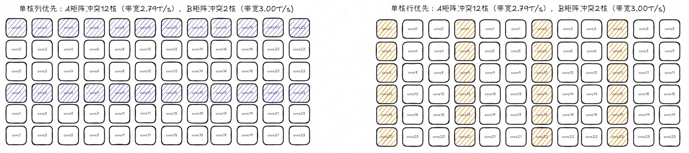

    为此可以使用错位分核的方式，减少M/N方向上的冲突核数，提升A/B矩阵的搬运带宽，优化整体带宽效率。

    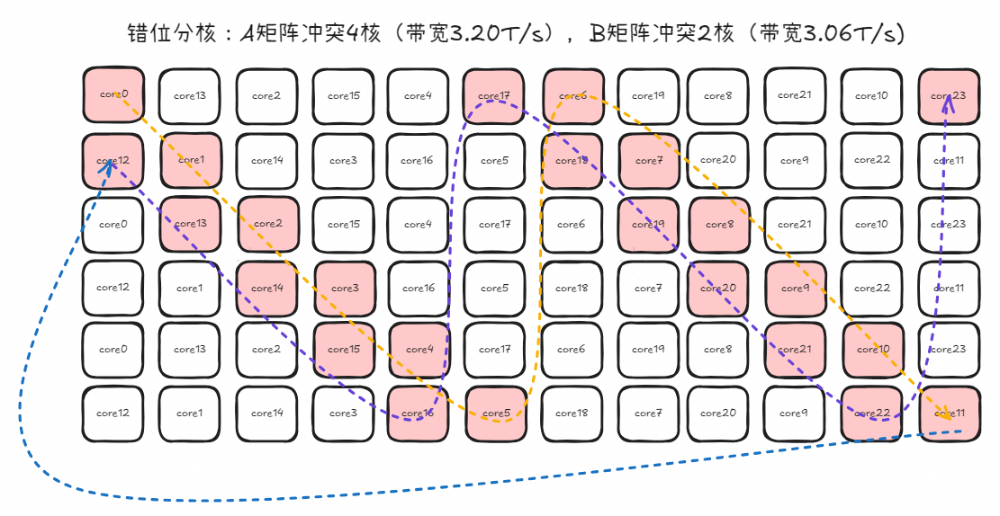

- **代码实践**

    ```cpp
    // 基于当前轮次，计算每个核应该计算的输出块所在的坐标
    __aicore__ inline void UpdateBasicIndex(const uint64_t roundIdx) {

        uint64_t newBlockIdx = (currentBlockIdx + coreNum - blockIdxStart) % coreNum + roundIdx * coreNum;
        uint64_t mIdx = newBlockIdx % mCntUse;
        uint64_t nIdx = 0;
        if (mCntUse != 0 && nCntUse != 0) {
            nIdx = (newBlockIdx + newBlockIdx / MMLcm(mCntUse, nCntUse)) % nCntUse;
        }
        index = mIdx * nCntUse + nIdx;
    }
    ```

- **测试效果**

    针对FP16用例(768, 8192)、(3072, 8192)展开验证，设计Tiling使用BaseM=128，BaseN=256，BaseK=64；算子实际搬运量（包含重复搬运）：ASize=144MB，BSize=288MB。

    |    搬运模式              |              搬运耗时     |
    |-------------------------|-------------------------|
    |            单核列优先     |    162.2us (2.97T/s)   |
    |            单核行优先     |     188.4us (2.40T/s)  |
    |             错位分核      |      141.7us (3.20T/s)  |


#### 双页表

- **理论分析**

    对于读写只使用一次的数据，可以控制该数据进入L2缓存，减少读/写数据经过L2的处理开销，如下图，采用双页表\(拆分进入L2内存和不进入L2内存\)，搬运数据流程中，通过设置内存使用标记，在黄色块处控制读写数据是否经过L2，走绿色的线单次读写更快。

    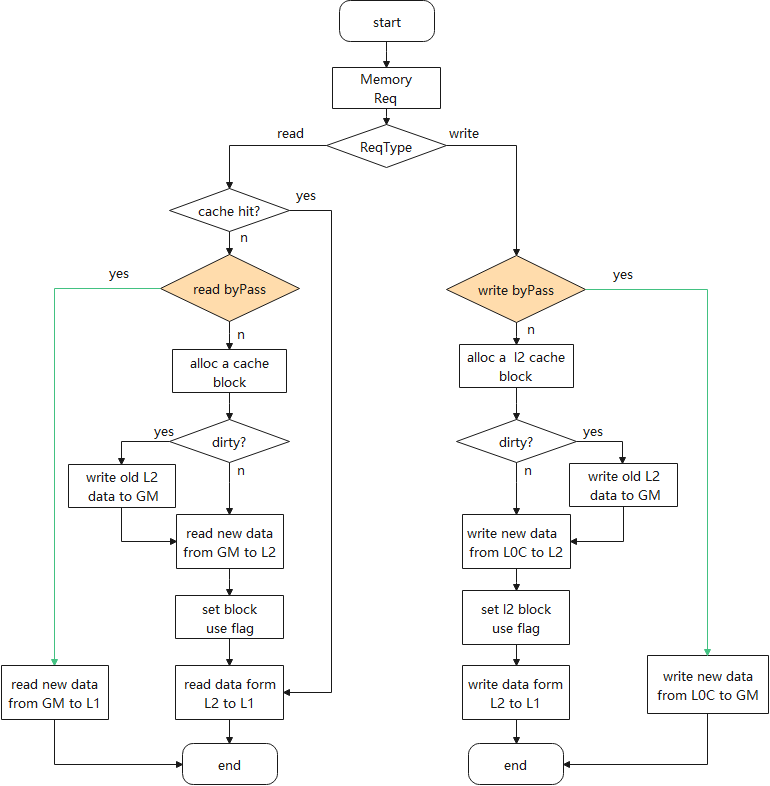

- **代码实践**

    ```cpp
    // optiling侧设置读/写数据是否经过L2
    void L2Cache::SetL2CacheFlag(bool aEnableL2Cache, bool bEnableL2Cache, bool cEnableL2Cache,
                                 bool biasEnableL2Cache, uint32_t &l2CacheFlag) {

        if (aEnableL2Cache && bEnableL2Cache && cEnableL2Cache && biasEnableL2Cache) {
            l2CacheFlag |= (1 << ALL_L2_ENABLE_BIT);
            OP_LOGD(args_.opName, "l2CacheFlag: %u", l2CacheFlag);
            return;
        }
        if (!aEnableL2Cache) {
            l2CacheFlag |= (1 << A_L2_DISABLE_BIT);
        }
        if (!bEnableL2Cache) {
            l2CacheFlag |= (1 << B_L2_DISABLE_BIT);
        }
        if (!cEnableL2Cache) {
            l2CacheFlag |= (1 << C_L2_DISABLE_BIT);
        }
        if (!biasEnableL2Cache) {
            l2CacheFlag |= (1 << BIAS_L2_DISABLE_BIT);
        }
        OP_LOGI(args_.opName, "l2CacheFlag: %u", l2CacheFlag);

    // 模板侧通过调用API接口(SetL2CacheHint)配置
    // C矩阵不进入L2控制
    template <class A_T, class B_T, class C_T, class BiasT>
    __aicore__ inline void SetL2CacheEnable(const L2cacheUseInfo& l2EnableInfo,
        GlobalTensor<A_T> &aGlobal, GlobalTensor<B_T> &bGlobal,
        GlobalTensor<C_T> &cGlobal, GlobalTensor<BiasT> &biasGlobal) {

        if ((l2EnableInfo.l2CacheFlag & ALL_L2_CACHE_ENABLE) == 0) {
            if (l2EnableInfo.l2CacheFlag & C_L2_DISABLE) {
                cGlobal.SetL2CacheHint(CacheMode::CACHE_MODE_DISABLE);
            }
        }
    }

    // 左、右矩阵仅搬运一次的情形
    if (IS_NKM && (block_.matmulTilingData_->matmulTiling.stepN *
        block_.matmulTilingData_->matmulTiling.baseN == block_.matmulTilingData_->matmulTiling.N)) {
        aGlobal_.SetL2CacheHint(CacheMode::CACHE_MODE_DISABLE);
    } else if (!IS_NKM && (block_.matmulTilingData_->matmulTiling.stepM *
        block_.matmulTilingData_->matmulTiling.baseM == block_.matmulTilingData_->matmulTiling.M)) {
        bGlobal_.SetL2CacheHint(CacheMode::CACHE_MODE_DISABLE);
    }
    ```

### 软硬协同提升并行度

#### unitflag

为了提高计算访存比，降低对带宽的需求，要求选择更大的baseM/baseN，导致L0C Buffer无法开启Double，进而引起MMAD和FIXP指令因同步关系存在断流。

为了解决这类问题，当前支持通过Unitflag能力，实现MMAD指令和FIXP指令从指令级的同步转变成Block级同步。当最后一条MMAD指令计算完一个Block后，对应Block的矩阵输出结果已经完成计算，FIXP就可以从L0C搬出，优化流水如下所示：

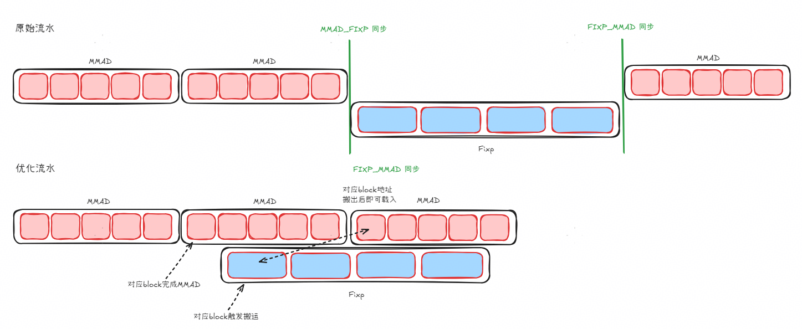

```cpp
// 第7位表示是否使能Untifalg，置True即使能
constexpr MatmulConfig MM_CFG_UNITFLAG = GetMDLConfig(false, false, 0, false, false, false, true);
```

#### preload

通常MatMul的普遍DB写法实现的指令发射顺序如下所示：

```cpp
MTE2_PING()
    MTE1_PING()
    MMAD_PING()
    MTE1_PONG()
    MMAD_PONG()
    ...
MTE2_PONG()
    ...
```

MTE2\_PONG的指令会在MTE2\_PING类的全部指令发射完毕后才会发射，如果中间MTE1/MMAD的指令过多，超出了芯片预设的指令队列深度，就会导致MTE2\_PONG指令无法发出，即使前面没有同步依赖。具体流水如下：


为此可以对MTE2指令使能preload，让指令提前发射，从而避免因ISSUE QUEE FULL导致指令阻塞，出现流水断流，修改后的指令发射顺序为：

```cpp
MTE2_PING()
MTE2_PONG() // 优先发送PONG的MTE2
    MTE1_PING() //完成MTE2_PING对应的MTE1和MMAD指令
    MMAD_PING()
    MTE1_PONG()
    MMAD_PONG()
    ...
MTE2_PING() // 继续优先发送下一轮PING的MTE2
    MTE1_PING() // 完成上一轮MTE2_PONG对应的MTE1和MMAD指令，实现解耦
    MMAD_PING()
    MTE1_PONG()
    MMAD_PONG()
    ...
```

优化完的流水如下所示：


