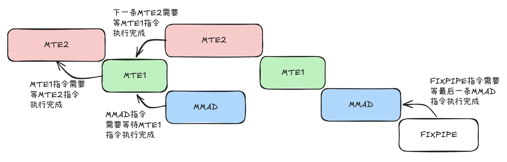
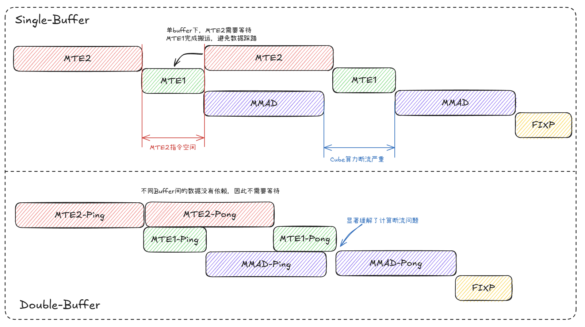
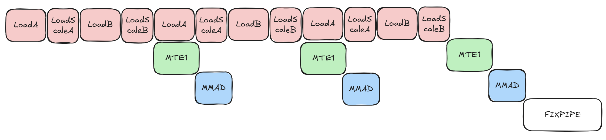
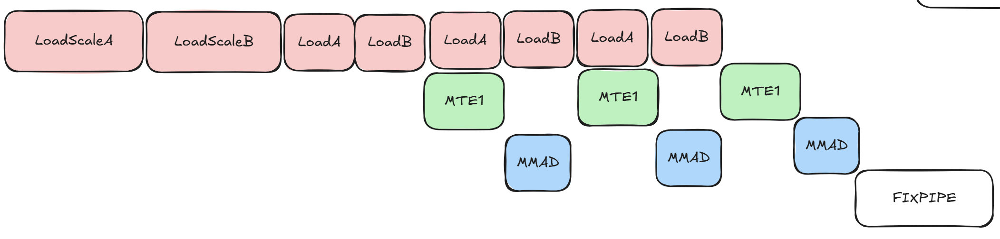
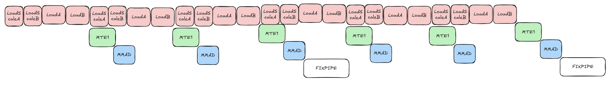
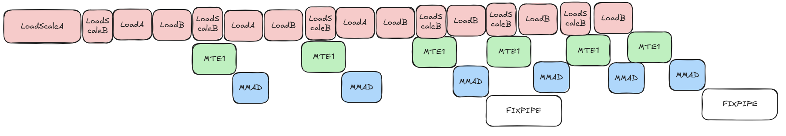

# MXFP4 量化矩阵乘教程：流水分析与分步优化

> **本文档**整理各 Step 的 **问题背景、优化思路与流水对照**；**编译、安装与运行** 请见 [`matmul_tutorials/README.md`](../matmul_tutorials/README.md)。

## 摘要

本文档说明 `matmul_tutorials` 目录内 **MXFP4 量化矩阵乘** Step 样例的组织方式：自 **Step 0 基准** 出发，经各 Step 优化，依次交代各步 **问题背景**、**优化思路** 及与 **Shape**、**硬件流水** 的对照读法。读者可据此选用或排布样例，亦可将同一分析范式迁移至其他 `m×k×n` 组合。

性能建模、Bound 判定与策略取舍的系统性论述，见 [MXFP4 量化矩阵乘算子性能优化指南](quant_matmul_mxfp4_performance.md)。

---

## 前言

各Step技术章节按 **问题背景 → 优化思路 → 典型 Shape  → 示例 Case 与流水分析 → 代码索引比对** 展开：**问题背景** 说明本节承接的实现及其暴露的矛盾，即前一阶段在给定假设下仍未能消除的瓶颈；**优化思路** 随之给出本节在 **核内缓冲**、**多核排布**、**尾块切分** 或 **指令级同步（如 UnitFlag）** 等维度上的优化要点。其后各节给出与 Shape 相关的定性条件、可复现 `m,k,n` 及 Profiling 对照项。

## 流水与数据流基础

本节给出各Step技术章节共用的 **物理流水视图**。

### 存储层次与数据流

| 层级 | 功能 |
|------|-----------|
| **Global Memory（GM）** | 存放完整 A、B、scaleA、scaleB 及输出 C，各个核共用。 |
| **L1 Buffer** | 位于GM和L0 Buffer之间的一块存储硬件，存放A/B矩阵以及Scale矩阵，各个核独立。 |
| **L0 A/B Buffer** | 位于L1 Buffer和MMAD计算单元之间的一块存储硬件，存放A/B矩阵，各个核独立。 |
| **L0 MX A/B Buffer** | 位于L1 Buffer和MMAD计算单元之间的一块存储硬件，存放Scale A/B矩阵，各个核独立。 |
| **L0C Buffer** | 一块存储硬件，存放MMAD计算单元运算的结果，各个核独立。 |

### 数据搬运组件

| 组件 | 功能 |
|------|------|
| **MTE2** | GM 与 L1 之间的数据搬运。 |
| **MTE1** | L1 与 L0 之间的数据搬运。 |
| **MMAD** | MXFP4 反量化与矩阵乘累加。 |
| **FIXPIPE** | L0C 至 GM 的写回。 |

数据路径可概括为：**GM →（MTE2）→ L1 →（MTE1）→ L0 → MMAD → L0C →（FIXPIPE）→ GM**。

  

### 符号与约定

下列记号通篇统一；示例 Case 中的取值须满足 Host 侧校验（见各 Step 源码中的参数检查）。

- `baseM`、`baseN`：核在一个round中完成计算的tile块大小。
- `blockNum`：Device 侧的AIC核数。
- `round`：各个核进行计算的轮数，并行计算情况下，一轮中32个核会完成32个tile块的计算，不满32个tile块则仅有部分核参与计算。

---

## 0 基础实现

### 0.1 问题背景

Step 0 实现一个基础的mxfp4的matmul调用Demo，承担 **基准** 角色，后续的优化策略在此基础上一步一步实施。在尚未引入各优化手段之前，按照列优先遍历输出每个Tile块从而完成整个矩阵运算。

### 0.2 实现总结

本章节实现mxfp4类型矩阵乘的极简版本， 提供**标准搬运/MMAD 流水/L1 和L0 单Buffer与通用列优先 block 调度策略** ，给出可复现参考实现：Host 启动、列优先Block调度、Block内数据搬运计算时序，构成后续各章的 **对照组**。

### 0.3 典型 Shape 

- 不涉及

### 0.4 示例 Case 与流水分析

**Case_8448_4096_12288**  
下图是输出一个Tile块的时序图。数据搬运与计算之间存在先后关系。从图中可以看到MMAD的计算依赖MTE1搬运、MTE1的搬运依赖MTE2、FIXPIPE的搬运依赖MMAD的计算。因为本case受L1/L0空间大小限制，K方向不可能一次性地载入L0进行计算，所以为了简单表示，图中只画了2个MMAD指令。

  

### 0.5 代码索引比对

- **样例根目录**：[0_naive](../matmul_tutorials/0_naive/)

---

## 1 Double-Buffer

### 1.1 问题背景

从Tile块执行的时序图上进行分析，**GM→L1 搬运**与 **L1→L0 搬运及 MMAD 计算** 完全串行，流水没有重叠，硬件利用率低下。为什么会出现这种情况呢？ 因为L1、L0A和L0B上只有一块buffer可供使用，各条流水线上运行过程中必须要互相等待，避免由于数据抢占而导致的精度错误。

### 1.2 优化思路

显然L1、L0级上需要开启双Buffer。MTE1读取L1上ping块数据时，MTE2写入L1pong块缓存。MTE1读取L1上pong块数据时，MTE2写入L1ping块缓存。由此，L1 级 Ping-Pong 使 MTE2 与 MTE1 重叠。MMAD计算读取L0A/L0Bping块缓存时，MTE1写入L0A/L0Bpong块缓存，MMAD计算读取L0A/L0Bpong块缓存时，MTE1写入L0A/L0Bping块缓存。由此，L0 级 Ping-Pong 使 MTE1 与 MMAD 重叠。未开启PingPong和开启Pingpong的预期流水如下。

  

### 1.3 典型 Shape 

- Shape：`[8448, 4096, 12288]`（即 `m=8448, k=4096, n=12288`）

### 1.4 示例 Case 与流水分析

- **Case**：`m=8448, k=4096, n=12288`

使用msprof来分析`m=8448, k=4096, n=12288`的基线性能和ping-pong开启后的性能。从Task时间来看性能显著提高了。
| 场景 | Task时间 | mte2搬运时间 | mte2占比 | cube时间 | cube占比 |
|------|---------:|-------------:|---------:|---------:|---------:|
| 基线 | 1176.66 | 526.0 | 0.44 | 542.032 | 0.46 |
| 开 Ping-Pong 后 | 605.8 | 577.1 | 0.95 | 508.4 | 0.84 |

### 1.5 代码索引比对

- **样例根目录**：[1_pingpong/](1_pingpong/)

---

## 2 SWAT 调度优化

### 2.1 问题背景

承接 Step 0（基准为 **列优先** tile 序）：**多核** 侧若仍采用 **简单行/列扫描式** 调度（与 **Step 3** 本节的 SWAT 调度相比），在同一调度轮次内各核所访问的 tile 在 **M–N 平面** 上分布范围较大，影响首轮搬运与计算阶段的衔接。

### 2.2 优化思路

在 **保持与 Step 0 同类 BlockMmad 数据通路**（不改 GM→L1→L0→MMAD 流水）的前提下，仅替换调度侧 **`GetTileIdx`**：引入 **M 向滑动窗口**（如 `WINDOW_LEN=4`）与 **N 向 Z 型** 往复，使同一轮多核对 tile 的访问尽量集中于较规则的 **M–N** 子区域，从而提高 **空间局部性**；同时使 **MTE2** 数据搬运与 **MMAD** 的时间重叠程度更高，从而提高 **Cube** 计算单元利用率。

### 2.3 典型 Shape 

- `mCnt×nCnt` 较大，例如二者均 **不小于 4**，使得多核 **同一轮内** tile 的空间分布对缓存/带宽行为敏感。  
- `k` 适中或偏大，使得单 tile 内核内工作量足以支撑 **MMAD 连续执行**，从而放大首轮搬运准备对性能的影响差异。

### 2.4 示例 Case 与流水分析

**Case_1280_512_4096（多 tile、便于对比行列访问对流水的影响）**  
- Shape：`m=1280, k=512, n=4096`。  
- 在 `baseM=baseN=256` 下，`totalCnt=5×16=80`。  

  

### 2.5 代码索引比对

- **样例根目录**：[3_block_swat](../matmul_tutorials/3_block_swat/)

---

## 3 尾轮 tile 负载均衡

### 3.1 问题背景

在 **Step 3** 中，我们对 block 的调度进行了优化。但注意到，由于 **单个 tile 大小** 在调度阶段确定（`baseM×baseN`及边界 `tailM`/`tailN`），固定的切分策略下，**尾轮** 容易出现 tile 块个数小于 `blockNum` 核数的情况，在此场景下，若各 tile 仍作为单块分配至不同核，则尾轮可参与的核数会小于 `blockNum`，部分核无法参与计算，导致尾轮吞吐量下降，对于此种情况，我们需要考虑一种新的切分策略。

  

### 3.2 优化思路

在 **沿用 Step 3 式多核排布**（或同类 SWAT 调度）的前提下，对尾轮 tile 块实施 **`mTailTile×nTailTile` 二次切分**，如图所示，减小尾轮 tile 块大小，从而增加尾轮 tile 块数量，分配到更多的核上计算，**提高并行度**。

  

### 3.3 典型 Shape 

- 尾轮 **待处理 tile 数** 显著小于 `blockNum`，例如 32 核下尾轮仅有 4 个 tile 块，通常保证二次切分后新 tile 数量可增至接近核数。 

### 3.4 示例 Case 与流水分析

**Case_1280_512_4096（多 tile、便于对比行列访问对流水的影响）**  
- Shape：`m=1280, k=512, n=4096`。  
- 在 `baseM=baseN=256` 下，`totalCnt=5×16=80`。  
- 若 `blockNum=32`，则 `round=3`：**尾轮余 16 个 tile**，每个tile**大小为（256， 256）**，如果无尾轮负载均衡，则出现16个核计算，16个核空闲的情况，而在尾轮负载均衡情况下（当前固定n方向切分成2块），则**剩余的16个tile**被切分为**32个tile**，每个**tile大小为（256, 128）**。  
- **流水关注点**：**Step 4** 引入尾块子划分后，尾轮 **并行 MMAD 实例数与耗时** 的变化。

从下图中可以看出，在对尾轮tile块进行拆分后，对比拆分前，尾轮tile块计算的耗时显著减少

  

### 3.5 代码索引比对

- **样例根目录**：[4_last_round_tile_balance](../matmul_tutorials/4_last_round_tile_balance/)

---

## 4 UnitFlag 优化

### 4.1 问题背景

未开启 **UnitFlag** 时，**`FIXPIPE` 须待 `MMAD` 指令全部执行完毕后才能开始将 `L0C` 结果搬出**。因此 **`MMAD` 整段计算** 与 **`FIXPIPE` 搬出** 之间是 **整段完成依赖**：须先满足 **全量 `MMAD` 结束** 这一条件，`FIXPIPE` 方可启动。在 **无法用 L0C Double Buffer** 等机制缓冲、掩盖该依赖时，**`FIXPIPE` 在 `MMAD` 运行期间处于等待**，**两段流水难以时间重叠**，造成性能损失，如图所示。

  

### 4.2 优化思路

**UnitFlag** 为 **`MMAD` 计算指令** 与 **`FIXPIPE` 数据搬运指令** 提供基于内存访问的 **细粒度同步（512B 粒度）**。开启后，`MMAD` **每计算完 512B 数据**，`FIXPIPE` **即可搬出对应数据块**，从而在 **无法开启 L0C Double-Buffer** 的条件下 **提高计算与搬出流水的并行度**。

  

### 4.3 典型 Shape 

本节不绑定具体 `m,k,n` 数值。

### 4.4 示例 Case 与流水分析

在下图中，相邻基本块的MMAD指令不再强制等待FIXPIPE，一定程度上提高了流水并行度

  

### 4.5 代码索引比对

- **样例根目录**：[5_unit_flag](../matmul_tutorials/5_unit_flag/)

---

## 5 解决 L1 Bank 冲突（5_halfl1_ping_halfl1_pong）

### 5.1 问题背景

本节介绍的优化手段在当前芯片下对整体case性能影响不大。若大家想了解L1的bank冲突相关的技术，可以了解下。若不感兴趣，只需要了解本优化策略让**L1上前一半放入A、scaleA、B和scaleB矩阵的ping块，后一半放入A、scaleA、B和scaleB矩阵的pong块**。MTE2指令和MTE1指令会同时操作L1的内存，前者将pong块/ping块的数据写入L1，后者从L1中读取ping块/pong块的数据。芯片策略是优先写L1，如果MTE2写入的数据和MTE1读取的数据在同一个bank上，那么有可能会受bank冲突影响导致读带宽降低，体现在MTE1指令的读取速度上。

### 5.2 优化思路

L1上存在2个bank，前面一半是和后一半分别是2个bank。如果写数据的地址空间和读数据的地址空间在不同的bank上，那么就不会出现bank冲突。当前芯片上bank冲突会影响L1空间上的读取数据。采用 **顺序 L1 布局**（A_ping | A_pong | B_ping | B_pong | …）时，MTE2指令写L1的pong块数据和MTE1指令读取L1的ping块数据时，若二者访问的数据落于同一 L1 bank，就会产生 **bank 冲突**，导致MTE1访问延迟增加。因此采取通过 **L1前半段放ping块、L1后半段放pong块** 策略解除 bank 冲突。这样ping块的访问和pong块的访问就能分布在L1两个不同的bank，避免bank冲突。

下图是 解决L1-BANK冲突前后L1的数据排布图。

  

### 5.3 典型 Shape

- Shape：`[256, 4096, 256]`

### 5.4 示例 Case 与流水分析

- **Case**：`m=256, k=4096, n=256`
拿上面这个 case 来分析 **解决 bank 冲突** 前后的 MTE1 指令访问速度。从流水图中统计各 MTE1 指令的平均耗时。MTE1 下主要有两类指令：**LOAD_2Dv2**（A、B 的 L1→L0A/L0B）与 **LOAD_MX_2Dv2**（scaleA、scaleB 的 L1→L0A/L0B）。下表为同一 Case 下优化前后对照（单位是cycle）。

| 场景 | LOAD_2Dv2 平均耗时 | LOAD_MX_2Dv2 平均耗时 | 次数 |
|------|-------------------:|----------------------:|-----:|
| 解决 bank 冲突前 | 270 | 442 | 32 |
| 解决 bank 冲突后 | 233 | 384 | 32 |

可见在 **次数不变**（均为 32）的前提下，两类 LOAD 的平均耗时在解决 bank 冲突后均有下降，MTE1 搬运效率提高。

### 5.5 代码目录

- **样例根目录**：[5_halfl1_ping_halfl1_pong](../matmul_tutorials/5_halfl1_ping_halfl1_pong/)

## 6 Scale矩阵 内存访问合并优化（6_scale_memory_access_coalescing）

### 6.1 问题背景

现在研究访存bound的case的性能优化。比如`[128, 8192, 4096]`，表现在流水上 **MTE2 段长时间连续、与后续 MTE1/MMAD 难以充分重叠**。对于这种场景，优化mte2 的搬运速度，才是关键。这类case的简化流水图如下所示：

  

本例中一次的搬运量如下，可以看出scaleA和scaleB的搬运量小于20K。搬运指令，若总数据量小于20K的话，对芯片搬运不友好，会导致速度降低。

$$
\mathrm{baseM}=128,\quad \mathrm{baseN}=128,\quad \mathrm{baseK}=512.
$$

**A**（左矩阵子块）：

$$
\mathrm{Bytes}_{A}
= \mathrm{baseM}\cdot\mathrm{baseK}\cdot|\mathrm{dtype}_{\mathrm{mxfp4}}|
= 128\times512\times\frac{1}{2}
= 32768\ \mathrm{B}.
$$

**B**（右矩阵子块）：

$$
\mathrm{Bytes}_{B}
= \mathrm{baseK}\cdot\mathrm{baseN}\cdot|\mathrm{dtype}_{\mathrm{mxfp4}}|
= 512\times128\times\frac{1}{2}
= 32768\ \mathrm{B}.
$$

**scaleA**（沿 K 每 32 个 MXFP4 元素共享 1 个 scale）：

$$
\mathrm{Bytes}_{\mathrm{scaleA}}
= \mathrm{baseM}\cdot\frac{\mathrm{baseK}}{32}\cdot|\mathrm{dtype}_{\mathrm{scale}}|
= 128\times\frac{512}{32}\times 1
= 2048\ \mathrm{B}.
$$

**scaleB**（沿 K 每 32 个 MXFP4 元素共享 1 个 scale）：

$$
\mathrm{Bytes}_{\mathrm{scaleB}}
= \mathrm{baseN}\cdot\frac{\mathrm{baseK}}{32}\cdot|\mathrm{dtype}_{\mathrm{scale}}|
= 128\times\frac{512}{32}\times 1
= 2048\ \mathrm{B}.
$$

### 6.2 优化思路

为了解决这个问题，引入**Scale访问合并** 策略，ScaleA 和ScaleB矩阵一次性载入多个 baseK 块（代码中使用`scaleKL1` 来表示）搬入L1 。在本例的这个case中设置scaleKL1为K方向的整个长度，将scale的K方向一次性搬入到L1。这样做的话符合芯片设计规格，可以提高访存速度。采用**Scale访问合并** 策略后，scaleA和scaleB的搬运量如下。

**scaleA**（沿 K 每 32 个 MXFP4 元素共享 1 个 scale）：

$$
\mathrm{Bytes}_{\mathrm{scaleA}}
= \mathrm{baseM}\cdot\frac{\mathrm{scaleKL1}}{32}\cdot|\mathrm{dtype}_{\mathrm{scale}}|
= 128\times\frac{8192}{32}\times 1
= 32768\ \mathrm{B}.
$$

**scaleB**（沿 K 每 32 个 MXFP4 元素共享 1 个 scale）：

$$
\mathrm{Bytes}_{\mathrm{scaleB}}
= \mathrm{baseN}\cdot\frac{\mathrm{scaleKL1}}{32}\cdot|\mathrm{dtype}_{\mathrm{scale}}|
= 128\times\frac{8192}{32}\times 1
= 32768\ \mathrm{B}.
$$

在本例中，采用**Scale访问合并** 策略后，scaleA和scaleB只在首次会加载到L1，后续只有A和B矩阵加载到L1。

  

### 6.3 典型 Shape

- Shape：`[128, 8192, 4096]`

### 6.4 示例 Case 与流水分析

我们使用 msprof 工具采集**访问合并优化**前后的性能。下表为同一 Case 下 使能**访问合并优化**前后的 Task时间、MTE2时间 与访存占比对照（时间单位 μs）。（**通过调整scaleL1的大小来实现**）

| 配置 | scaleL1 | Task 时间 | MTE2 时间 | 访存占比 |
|------|---------|-----------|-----------|----------|
| 优化前 | `2×BASE_K`（1024） | 39.53 | 34.4 | 0.89 |
| 优化后 | `16×BASE_K`（8192） | 36.76 | 31.27 | 0.87 |

从性能对比来看，同样的数据量下 MTE2 搬运时间由 34.4 降低到 31.27 μs，Task 总时间相应下降。

### 6.5 代码目录

- **样例根目录**：[6_scale_memory_access_coalescing](../matmul_tutorials/6_scale_memory_access_coalescing/)

## 7 A 矩阵全载优化（7_fullload）

### 7.1 问题背景

上面优化的各个case，A矩阵和B矩阵需要在K方向进行切分，一块一块地搬入到L1/L0,完成K方向累加，最终将单个Tile块输入到HBM上。这种策略我们叫做**非全载策略**。但是如果A矩阵比较小而B矩阵特别大，若仍然采用上述策略，那么肯定会导致A矩阵重复搬运，很有可能会导致性能劣化。这回拿`[128, 4096, 81920]`来举例。使用非全载策略，流水示意图如下。矩阵A、scaleA、矩阵B和scaleB矩阵每次载入一个切块，到L1/L0,完成K方向累加。

  

让我们计算下左矩阵所占的总空间大小。通过计算发现左矩阵只占L1的一半空间。那么左矩阵是不是可以全载？
$$
\mathrm{baseM}=128，\quad \mathrm{K}=4096.
$$

$$
\mathrm{L1Size}= 524288.
$$

$$
\mathrm{Bytes}_{A}
= \mathrm{baseM}\cdot\mathrm{K}\cdot|\mathrm{dtype}_{\mathrm{mxfp4}}|
= 128\times4096\times\frac{1}{2}
= 262144\ \mathrm{B}.
$$

### 7.2 优化思路

因此，引入**A 矩阵全载（A-Full-Load）** 策略将左矩阵 A 常驻在L1空间上。这里采用的方式是按照切块大小去填满A矩阵在L1的空间，不是一次性加载完成。scaleA矩阵是一次性加载到L1的。右矩阵B和scaleB矩阵是按照切块大小一块一块地载入到L1。每计算输出一个切块，都可以复用驻留在L1上数据，这样可以最大限度地减少数据的重复搬运。采用该策略的流水示意图如下。

  

### 7.3 典型 Shape

- Shape：`[128, 4096, 81920]`

### 7.4 示例 Case 与流水分析

我们使用 msprof 工具采集非全载策略与全载策略下 Shape `[128, 4096, 81920]` 的性能数据。下表在 **`scaleKL1=KL1=1024`** 相同切片设定下对比两种策略（时间单位 μs）。

| 策略 | Task 时间 | MTE2 时间 | 访存占比 |
|------|-----------|-----------|----------|
| 非全载 | 183.87 | 178.35 | 0.97 |
| 全载 | 170.07 | 164.25 | 0.97 |

全载策略下 Task 与 MTE2 耗时均低于非全载，访存占比数值相同。下面估算两种策略下 **MTE2 等效搬运带宽**（字节/周期）。

**时间与周期换算**：芯片上 **1 μs = 1650 cycle**。

单核在全局上负责的 **B** 与 **scaleB** 搬运量（整块问题、与 A 重复次数无关）为

$$
\mathrm{baseM}=128,\quad \mathrm{baseN}=512,\quad \mathrm{baseK}=512,\quad K=4096.
$$

$$
\mathrm{blockNum}=32,\quad N=81920.
$$

$$
\begin{aligned}
\mathrm{Bytes}_{B}^{(\mathrm{pc})}
&= \frac{N\,K\,|\mathrm{dtype}_{\mathrm{mxfp4}}|}{\mathrm{blockNum}} \\
&= \frac{81920\times 4096\times \frac{1}{2}}{32} \\
&= 5242880\ \mathrm{B}.
\end{aligned}
$$

$$
\begin{aligned}
\mathrm{Bytes}_{\mathrm{scaleB}}^{(\mathrm{pc})}
&= \frac{N}{\mathrm{blockNum}}\cdot\frac{K}{32}\cdot|\mathrm{dtype}_{\mathrm{scale}}| \\
&= \frac{81920}{32}\times\frac{4096}{32}\times 1 \\
&= 327680\ \mathrm{B}.
\end{aligned}
$$

非全载时，左矩阵沿 **N** 按切块推进，单核在 **N** 方向需经历的 **块次数**（即 **A / scaleA 在全 \(K\) 上需重复搬运的次数**）为

$$
\begin{aligned}
T
&= \frac{N}{\mathrm{blockNum}\cdot\mathrm{baseN}} \\
&= \frac{81920}{32\times 512} \\
&= 5.
\end{aligned}
$$

**非全载**：A、scaleA 在每个 **N** 切块搬运时需要陪同搬运一次，故

$$
\begin{aligned}
\mathrm{Bytes}_{A}^{\mathrm{nl}}
&= T\cdot \mathrm{baseM}\,K\,|\mathrm{dtype}_{\mathrm{mxfp4}}| \\
&= 5\times 128\times 4096\times \frac{1}{2} \\
&= 1310720\ \mathrm{B}.
\end{aligned}
$$

$$
\begin{aligned}
\mathrm{Bytes}_{\mathrm{scaleA}}^{\mathrm{nl}}
&= T\cdot \mathrm{baseM}\,K\cdot\frac{|\mathrm{dtype}_{\mathrm{scale}}|}{32} \\
&= 5\times 128\times 4096\times \frac{1}{32} \\
&= 81920\ \mathrm{B}.
\end{aligned}
$$

MTE2 总搬运量与等效速度为

$$
\begin{aligned}
\mathrm{Bytes}_{\mathrm{total}}^{\mathrm{nl}}
&= \mathrm{Bytes}_{B}^{(\mathrm{pc})}
+ \mathrm{Bytes}_{\mathrm{scaleB}}^{(\mathrm{pc})}
+ \mathrm{Bytes}_{A}^{\mathrm{nl}}
+ \mathrm{Bytes}_{\mathrm{scaleA}}^{\mathrm{nl}} \\
&= 5242880 + 327680 + 1310720 + 81920 \\
&= 6963200\ \mathrm{B}.
\end{aligned}
$$

$$
\begin{aligned}
v_{\mathrm{MTE2}}^{\mathrm{nl}}
&= \frac{\mathrm{Bytes}_{\mathrm{total}}^{\mathrm{nl}}}{T_{\mathrm{MTE2}}\times 1650} \\
&= \frac{6963200}{178.35\times 1650} \\
&\approx 23.66\ \mathrm{B/cycle}.
\end{aligned}
$$

**全载**：A、scaleA 各驻留 L1，**仅搬运一次**，故

$$
\begin{aligned}
\mathrm{Bytes}_{A}^{\mathrm{fl}}
&= \mathrm{baseM}\,K\,|\mathrm{dtype}_{\mathrm{mxfp4}}| \\
&= 128\times 4096\times \frac{1}{2} \\
&= 262144\ \mathrm{B}.
\end{aligned}
$$

$$
\begin{aligned}
\mathrm{Bytes}_{\mathrm{scaleA}}^{\mathrm{fl}}
&= \mathrm{baseM}\,K\cdot\frac{|\mathrm{dtype}_{\mathrm{scale}}|}{32} \\
&= 128\times 4096\times \frac{1}{32} \\
&= 16384\ \mathrm{B}.
\end{aligned}
$$

$$
\begin{aligned}
\mathrm{Bytes}_{\mathrm{total}}^{\mathrm{fl}}
&= \mathrm{Bytes}_{B}^{(\mathrm{pc})}
+ \mathrm{Bytes}_{\mathrm{scaleB}}^{(\mathrm{pc})}
+ \mathrm{Bytes}_{A}^{\mathrm{fl}}
+ \mathrm{Bytes}_{\mathrm{scaleA}}^{\mathrm{fl}} \\
&= 5242880 + 327680 + 262144 + 16384 \\
&= 5849088\ \mathrm{B}.
\end{aligned}
$$

$$
\begin{aligned}
v_{\mathrm{MTE2}}^{\mathrm{fl}}
&= \frac{\mathrm{Bytes}_{\mathrm{total}}^{\mathrm{fl}}}{T_{\mathrm{MTE2}}\times 1650} \\
&= \frac{5849088}{164.25\times 1650} \\
&\approx 21.58\ \mathrm{B/cycle}.
\end{aligned}
$$

非全载与全载的 **搬运速度** 同一量级；全载通过去掉 A、scaleA 的重复搬运，在 **总搬运量更小** 的前提下得到 **更短 MTE2 时间** 与 **更优端到端性能**。二者对比说明：在访存 bound 场景下，**减少左矩阵重复搬运** 能有效提升实际表现。

### 7.5 代码目录

- **样例根目录**：[7_fullload](../matmul_tutorials/7_fullload/)

---

