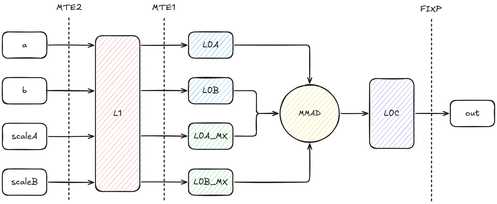
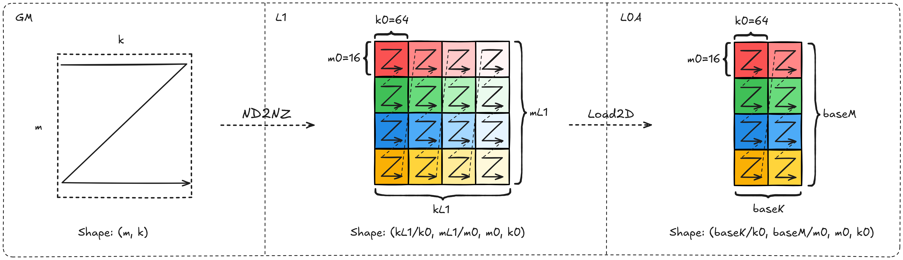
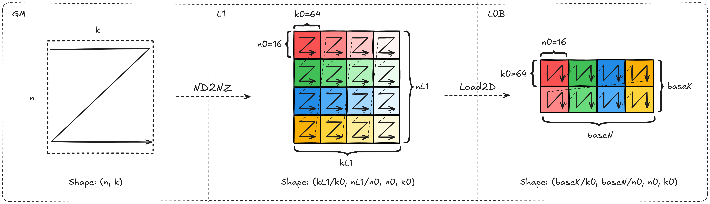
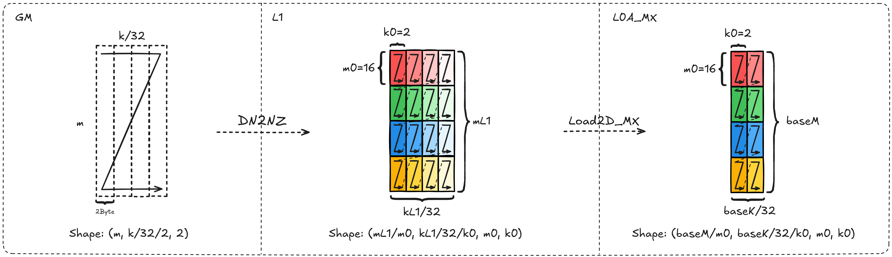
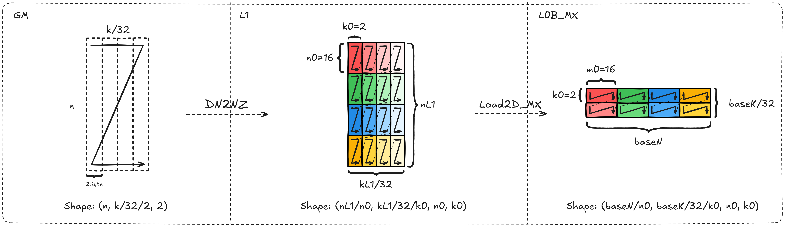
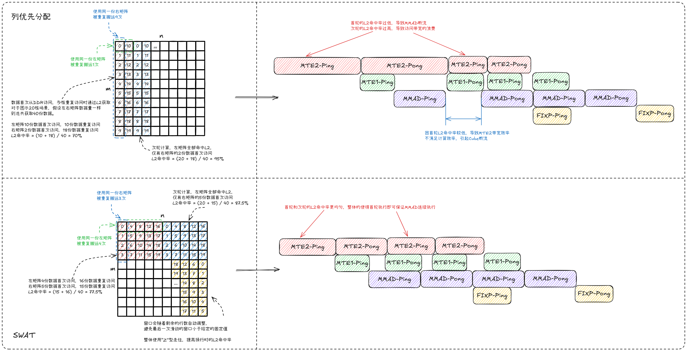
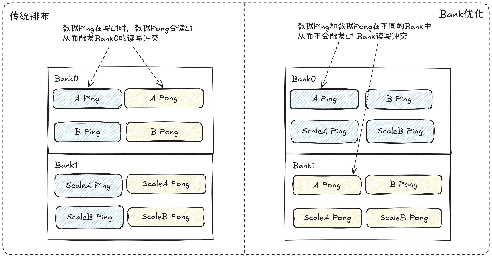

# MXFP4量化矩阵乘算子性能优化指南

## 概述

本文档系统阐述MXFP4量化矩阵乘算子的实现原理、性能建模方法及优化实践。通过系统性的优化策略，帮助开发者快速掌握算子性能调优的核心技术，提升算子在昇腾平台上的执行效率。

## 算子实现原理

### 算子功能说明

- **算子功能**：实现MXFP4类型的矩阵乘计算。MX量化等价于GroupSize=32、Scale类型为float8_e8m0的FP4 PerGroup量化，通过4位浮点数量化显著减少内存访问量，提升计算密度。相比传统的FP16/BF16格式，MXFP4可减少75%的内存占用，同时通过硬件加速保持较高的计算精度。

- **应用场景**：MXFP4量化矩阵乘特别适用于大语言模型（LLM）的推理场景，如Transformer架构中的注意力计算和前馈网络计算，在保持模型精度的同时显著提升推理吞吐量。

- **计算公式**：
$$
c_{_{i, j}} = \sum^{K/G-1}_{g=0}\left(scaleA_{g, i} \cdot scaleB_{g, j} \cdot \sum^{G-1}_{k'=0} (a_{i, gG+k'} \cdot b_{gG + k', j}) \right)
$$

- **参数说明**：

| **变量名** | **描述** | **Dtype** | **Layout** | **Shape** |
|-|-|-|-|-|
| a | 输入左矩阵 | `float4_e2m1` 或者 `float4_e1m2` | ND | (m, k) |
| b | 输入右矩阵 | `float4_e2m1` 或者 `float4_e1m2` | ND | (n, k) |
| scaleA | 左矩阵量化参数 | `float8_e8m0` | ND | (m, ceil(k/64), 2) |
| scaleB | 右矩阵量化参数 | `float8_e8m0` | ND | (n, ceil(k/64), 2) |
| c | 输出矩阵 | `float32` 或者 `float16` 或者 `bfloat16` | ND | (m, n) |

### 算子实现说明

与传统非量化Matmul算子相比，MXFP4场景新增了输入变量`scaleA`和`scaleB`，需要将其搬运至L1缓冲区，再搬运至`L0A_MX`和`L0B_MX`独立缓冲区。

通过约束`L0A`、`L0B`、`L0A_MX`、`L0B_MX`中Tensor的地址映射关系，芯片的`MMAD`指令支持自动计算MXFP4矩阵乘，并将`Float32`结果写入`L0C`缓冲区。通过设置`Fixpipe`指令的量化模式，输出预期的数据类型结果。**因此算子实现仅依赖CUBE核，不涉及MIX场景**。

MXFP4执行时的完整数据搬运流程如下图所示：

  

关于每个输入在各个缓冲区上的Shape关系和排布要求，可以参考下面的详细介绍。

**关键参数说明**：
- `m, k, n`：矩阵输入大小
- `mL1, kL1, nL1`：L1缓冲区的切分大小
- `baseM, baseK, baseN`：L0缓冲区的切分大小
- `m0, k0, n0`：当前缓冲区最小分型大小

#### Tensor a 的搬运说明

| **缓冲区变化** | **Shape排布变化** | **Layout变化** | **所属流水** | **所用指令** |
|-|-|-|-|-|
| GM -> L1 | (m, k) -> (ceil(kL1/k0), ceil(mL1/m0), m0, k0) | ND -> Nz | MTE2 | DataCopy with ND2NZ |
| L1 -> L0A | (ceil(kL1/k0), ceil(mL1/m0), m0, k0) -> (ceil(baseK/k0), ceil(baseM/m0), m0, k0) | Nz -> Nz | MTE1 | LoadData with Load2D |

  

    
  

#### Tensor b 的搬运说明

| **缓冲区变化** | **Shape排布变化** | **Layout变化** | **所属流水** | **所用指令** |
|-|-|-|-|-|
| GM -> L1 | (n, k) -> (ceil(kL1/k0), ceil(nL1/n0), n0, k0) | ND -> Nz | MTE2 | DataCopy with ND2NZ |
| L1 -> L0B | (ceil(kL1/k0), ceil(nL1/n0), n0, k0) -> (ceil(baseK/k0), ceil(baseN/n0), n0, k0) | Nz -> Zn | MTE1 | LoadData with Load2D |

> 这里L1和L0B上的Shape排布其实一样，但L0B默认按照(k, n)方向查看数据，因此Layout会变更成`Zn`

  

    
  

#### Tensor scaleA 的搬运说明

> 因为MX量化GroupSize=32的pergroup量化，因此K方向的大小是输入矩阵的1/32。这里描述的是Scale张量的分组与存储布局，输入侧仅要求`k`为偶数。

| **缓冲区变化** | **Shape排布变化** | **Layout变化** | **所属流水** | **所用指令** |
|-|-|-|-|-|
| GM -> L1 | (m, ceil(ceil(k/32)/2), 2) -> (ceil(mL1/m0), ceil(ceil(kL1/32)/k0), m0, k0) | ND -> Zz | MTE2 | DataCopy with ND2NZ |
| L1 -> L0A_MX | (ceil(mL1/m0), ceil(ceil(kL1/32)/k0), m0, k0) -> (ceil(baseM/m0), ceil(ceil(baseK/32)/k0), m0, k0) | Zz -> Zz | MTE1 | LoadData with Load2D_MX |

  

    
  

#### Tensor scaleB 的搬运说明

> 因为MX量化GroupSize=32的pergroup量化，因此K方向的大小是输入矩阵的1/32。这里描述的是Scale张量的分组与存储布局，输入侧仅要求`k`为偶数。

| **缓冲区变化** | **Shape排布变化** | **Layout变化** | **所属流水** | **所用指令** |
|-|-|-|-|-|
| GM -> L1 | (n, ceil(ceil(k/32)/2), 2) -> (ceil(nL1/n0), ceil(ceil(kL1/32)/k0), n0, k0) | ND -> Zz | MTE2 | DataCopy with ND2NZ |
| L1 -> L0B_MX | (ceil(nL1/n0), ceil(ceil(kL1/32)/k0), n0, k0) -> (ceil(baseN/n0), ceil(ceil(baseK/32)/k0), n0, k0) | Zz -> Nn | MTE1 | LoadData with Load2D_MX |

  

    
  

### 算子实现约束

1. **K维度对齐约束**：由于scale在L0_MX缓冲区上的最小分形为`(16, 2)`，对应输入矩阵在K方向的最小单位为64，要求**baseK是64的整数倍**。

2. **K维度补零处理**：基于约束1，当K轴非64对齐时，存在两类场景：
   - 当输入矩阵的K维度在内轴，即输入排布为`(m, k)`或`(n, k)`时，`ND2NZ`指令可自动完成K方向补零，无需特殊处理；
   - 当输入矩阵的K维度在外轴，即输入排布为`(k, m)`或`(k, n)`时，`ND2NZ`指令无法完成K方向补零，**需手动处理K方向补零**。

      推荐补零方法：使用`SET2D`对L1缓冲区目标地址清零 + `ND2NZ`跳写目标地址。

3. **数据类型处理**：由于`ND2NZ`指令不支持`B4`数据类型，需将输入按`B8`数据类型进行搬运，相应指令的`stride`和`shape`配置均需除以2。

4. **内轴对齐约束**：基于约束3，要求输入矩阵内轴为偶数，否则无法用2个`B4`拼成一个`B8`类型。

5. **指令约束**：`MMAD`指令需关闭`gemv`功能。

## 算子性能建模

### 性能瓶颈分析

MXFP4矩阵乘算子的性能瓶颈主要分为以下两类：

1. **Cube Bound**：算子性能受限于硬件的算力规格，本身已经实现连续的MMAD计算。这种场景通常意味着算子性能已经最优，但需要重点关注**多核计算负载是否均衡**，避免出现单核Cube Bound，但整体Cube利用率偏低的情况。

2. **Memory Bound**：算子性能受限于数据搬运能力，主要的性能优化手段是减少搬运量、提高带宽利用率或者将低带宽的搬运转换成高带宽的搬运，进而发挥算子极致性能。因Bound在不同的流水上而区分出**MTE2 Bound**、**MTE1 Bound**以及**FIXPIPE Bound**。

### 性能建模公式

#### 基本原理

理论计算时间 = max(MMAD时间, MTE2搬运时间, MTE1搬运时间, FIXPIPE搬出时间)

通过评估不同流水的理论耗时并加以对比，可以得到影响耗时的决定性因素，从而选择对应的优化策略。

#### 流水理论耗时评估

**1. MMAD计算时间**

$$
T_{cube} = \frac{M \times K \times N}{16 \times 64 \times 16 \times 核数 \times 频率}
$$

其中`16 × 64 × 16`表示MXFP4在Cube核上每拍的计算量。

**2. MTE2搬运时间**

MTE2的搬运量包含了因切分带来的重复搬运，以及对应Scale的重复搬运：

$$
T_{mte2} = \frac{(M \times \frac{N}{baseN} + N \times \frac{M}{baseM}) \times K \times (1 \times sizeof(dtype) + \frac{1}{32})}{BandWidth_{mte2}}
$$

MTE2的综合带宽包含DDR带宽和L2带宽的共同作用，可简化为：

$$
T_{mte2} \approx \frac{Size_{DDR}}{BandWidth_{DDR}} + \frac{Size_{L2}}{BandWidth_{L2}}
$$

其中：
- `Size_DDR = (M + N) × K × (1 × sizeof(dtype) + 1/32)` （首次搬运量）
- `Size_L2 = MTE2搬运量 - Size_DDR` （重复搬运量）

**3. MTE1搬运时间**

MTE1作为Cube核内的流水，以单核内的计算和搬运量进行评估：

$$
T_{mte1} = \frac{baseM \times baseK \times (1 \times sizeof(dtype) + \frac{1}{32})}{BandWidth_{L{0}A}} + \frac{baseN \times baseK \times (1 \times sizeof(dtype) + \frac{1}{32})}{BandWidth_{L{0}B}}
$$

**4. FIXPIPE搬出时间**

$$
T_{fixp} = \frac{M \times N \times sizeof(dtype)}{BandWidth_{fixp}}
$$

#### 流水理论耗时对比

算子期望最终变成CubeBound，因此可以将不同的搬运流水和计算流水展开对比，分析影响CubeBound的决定性因素。在理论无法达成CubeBound的背景下，选择优化策略优化各条搬运流水。

**1. MTE2 VS MMAD**

$$
\frac{M \times K \times N}{16 \times 64 \times 16 \times 核数 \times 频率} \geq \frac{(M \times \frac{N}{baseN} + N \times \frac{M}{baseM}) \times K \times (1 \times sizeof(dtype) + \frac{1}{32})}{BandWidth_{mte2}}
$$

化简后得到MTE2 Bound条件：

$$
BandWidth_{mte2} \geq (\frac{1}{baseN} + \frac{1}{baseM}) \times (1 \times sizeof(dtype) + \frac{1}{32}) \times 16 \times 64 \times 16 \times 核数 \times 频率
$$

**特征分析**：
- 当MTE2带宽满足上述条件时，算子性能受限于计算单元（Cube Bound）
- 不满足条件时，算子性能受限于MTE2数据搬运（MTE2 Bound）
- 右侧表达式主要受tiling参数（baseM, baseN）和硬件配置（核数、频率）影响
- 增大baseM和baseN可以降低右侧数值，更容易满足Cube Bound条件（主要受限于L0C缓冲区大小）

**2. MTE1 VS MMAD**

由于MTE1和MMAD均为Cube核内部流水，因此可以将公式化简到单核内对比：

$$
\frac{baseM \times baseK \times baseN}{16 \times 64 \times 16 \times 频率} \geq \frac{baseM \times baseK \times (1 \times sizeof(dtype) + \frac{1}{32})}{BandWidth_{L{0}A}} + \frac{baseN \times baseK \times (1 \times sizeof(dtype) + \frac{1}{32})}{BandWidth_{L{0}B}}
$$

化简后得到MTE1 Bound条件：

$$
\frac{baseM \times baseN}{16 \times 64 \times 16 \times 频率} \geq \frac{baseM \times (1 \times sizeof(dtype) + \frac{1}{32})}{BandWidth_{L{0}A}} + \frac{baseN \times (1 \times sizeof(dtype) + \frac{1}{32})}{BandWidth_{L{0}B}}
$$

当L0A和L0B的带宽一致时，可进一步化简：

$$
BandWidth_{mte1} \geq (\frac{1}{baseN} + \frac{1}{baseM}) \times (1 \times sizeof(dtype) + \frac{1}{32}) \times 16 \times 64 \times 16 \times 频率
$$

**特征分析**：
- 当满足上述条件时，L1到L0的数据搬运不成为性能瓶颈
- 不满足条件时，算子性能受限于MTE1数据搬运（MTE1 Bound）
- 右侧表达式主要受tiling参数（baseM, baseN）和L0缓冲区带宽影响
- 增大baseM和baseN可以降低右侧数值，更容易满足Cube Bound条件

**3. FIXPIPE VS MMAD**

$$
\frac{M \times K \times N}{16 \times 64 \times 16 \times 核数 \times 频率} \geq \frac{M \times N \times sizeof(dtype)}{BandWidth_{fixp}}
$$

化简后得到FIXPIPE Bound条件：

$$
BandWidth_{fixp} \geq \frac{16 \times 64 \times 16 \times 核数 \times 频率 \times sizeof(dtype)}{K}
$$

**特征分析**：
- 当满足上述条件时，L0C到GM的数据搬出不成为性能瓶颈
- 不满足条件时，算子性能受限于FIXPIPE数据搬出（FIXPIPE Bound）
- 右侧表达式与K维度成反比；对于大K场景，通常不会出现FIXPIPE Bound；对于小K场景，FIXPIPE Bound更容易成为瓶颈

**建模说明**：
- 该模型基于流水线理论，整体性能受限于最慢的流水阶段
- 通过分析比较各阶段的时间，从而准确识别性能瓶颈类型
- 优化目标是令算子在预期的流水上进行Bound，并将对应流水优化到极致
- 实际应用中还需考虑指令发射延迟、流水线并行度等额外开销

### 优化目标

基于理论公式对比，识别当前的Bound类型，应用相应的优化策略，使各流水阶段的时间尽可能接近，从而最大化整体算子性能。

## 算子优化实践

本章介绍MXFP4中应用的优化措施，针对不同的Bound类型场景分别提供**搬运效率优化**、**计算效率优化**方法，以及针对因流水阻塞导致Bound类型不明确的场景提供**指令并行度优化**实践。

### 搬运效率优化

#### SWAT（自适应滑动窗口模板）

- **原理介绍**

  SWAT(Slide Window Adaptive Template)通过提升多核单次访问的L2命中率来提高`MTE2`搬运效率，从而实现首轮搬运即可做到`MMAD`指令不断流，使算子在Cube Bound场景下计算单元利用率达到95%+。

  核心逻辑是使每一轮多核计算的输出排布尽量**方正**，具体方法是在M轴上设定固定窗口，根据M轴方向尾块大小灵活调整，再沿N方向进行"Z"型滑动，从而最大程度提高L2命中率。

- **效果对比**

  下图对比了传统的列优先分配和SWAT的理论效果。

  

    
  

- **适用场景**
  - 大规模矩阵乘法场景
  - 多核并行计算场景
  - Cube Bound为主要瓶颈的场景

#### L1 Bank冲突优化

- **原理介绍**

  L1缓冲区以256KB粒度分为两个Bank，当同时对同一Bank进行读写操作时，会触发Bank冲突，导致`MTE1`带宽效率降低，进而打断`MMAD`指令连续性。

  因此在开启L1 Double Buffer时，需将两份缓存的数据放置于不同Bank中，从而避免读写冲突导致的Bank冲突。

- **效果对比**

  

    
  

- **适用场景**
  - 开启了L1 Double Buffer的场景
  - MTE1带宽利用率不足的场景
  - 存在Bank冲突导致`MMAD`断流的场景

#### Scale缓存优化

- **原理介绍**

  Scale部分的数据量仅为输入矩阵的1/32，当输入矩阵较小时，所需Scale数据量急剧减小，无法充分发挥带宽性能，导致Scale搬运带宽利用率显著降低。

  可利用L1剩余空间，提前载入后续所需Scale并在L1上缓存，从而减少Scale搬运次数，缓解因单次所需Scale数据量过小导致的带宽速率降低问题。

- **效果对比**

  

    
  

- **适用场景**
  - 输入矩阵较小，Scale数据量不足的场景
  - MTE2带宽利用率受Scale搬运限制的场景
  - L1缓冲区有充足剩余空间的场景

#### 全载优化

- **原理介绍**

  在MTE2 Bound场景中，可通过减少`MTE2`部分的整体搬运量来提高算子性能。对于输入可完整缓存在L1中的场景，可使用全载模板，在不同轮询中使输入始终驻留在L1中，从而减少整体搬运耗时。

- **效果对比**

  

    
  

- **适用场景**
  - MTE2 Bound为主要瓶颈的场景
  - 输入矩阵较小，可以完全载入L1的场景
  - Decode等小批量计算场景

### 计算效率优化

#### 尾轮负载均衡

- **原理介绍**

  当前Matmul算子普遍使用基本块策略进行多核分配。但在处理不同规格输入时，划分的基本块无法均匀分配到所有核上，导致分核不均，尤其是最后一轮计算存在算力浪费，使整体算力利用率无法达到最优。

  可将最后一轮未完全分配的基本块进行二次切分，使其尽量均匀分配到多核中，充分发挥完整算力。

- **效果对比**

  

    
  

- **适用场景**
  - 多核并行计算场景
  - 输入形状不规则，无法均匀分配的场景
  - 最后一轮计算存在算力浪费的场景

### 指令并行度优化

#### Double Buffer（双缓冲）

- **原理介绍**

  Double Buffer使用两个缓冲区交替工作：一个缓冲区用于当前计算，另一个并行准备下一轮数据。通过计算与数据加载/准备的重叠，隐藏内存访问延迟，减少流水线停顿，提高算子吞吐量。

- **效果对比**

  下图展示了使能Double Buffer后流水图的预期变化，从而有效提升不同流水间的并行度。如果缓冲区空间足够，可以进一步延伸出`4-Buffer`等其他分配方案，从而适配不同场景。

  

    
  

- **适用场景**
  - 存在流水停顿的场景
  - 内存访问延迟成为瓶颈的场景
  - L1或L0缓冲区空间充足的场景

#### UnitFlag（单元标志）

- **原理介绍**

  UnitFlag为`MMAD`计算指令和`FIXPIPE`数据搬运指令提供基于内存访问的细粒度同步（512B粒度）。未开启时，FIXPIPE需等MMAD指令完全执行完才开始搬出；开启后，MMAD每计算完512B数据，FIXPIPE立即搬出该数据块，**实现在无法开启L0C Double-Buffer的情况下提高计算与搬出流水的并行度**。

- **效果对比**

  由性能建模可知，为充分发挥计算访存比，需尽可能用满`L0C`缓冲区，导致存在无法在`L0C`缓冲区上开启Double Buffer的场景，此时可启用UnitFlag功能来提高指令并行度。

  

    
  

- **适用场景**
  - 无法开启L0C Double Buffer的场景
  - MMAD和FIXPIPE流水串行执行的场景
  - 需要提高计算与搬出并行度的场景

## 算子模板归纳

### SWAT模板

- **模板特点**：
  - 作为基础模板用于处理非特化模板的所有场景，具有广泛的适用性
  - 适用于大规模矩阵乘法场景，在Cube Bound场景下表现优异
  - 支持灵活的形状配置，可适应不同维度的矩阵输入
  - 综合性能最优，是大多数应用场景的首选模板

- **涉及优化手段**：
  - SWAT（自适应滑动窗口）：提升L2命中率，优化多核并行效率
  - L1 Bank冲突优化：消除Bank冲突，提升MTE1带宽利用率
  - Scale缓存：优化Scale数据搬运，减少传输开销
  - 尾轮负载均衡：均衡多核负载，消除算力浪费
  - Double Buffer：隐藏内存访问延迟，提升流水线并行度
  - UnitFlag：提升计算与搬出流水并行度

- **模板实现（非A全载）**：[quant_matmul_mxfp4_swat.cpp](../matmul_recipes/examples/quant_matmul_mxfp4/quant_matmul_mxfp4_swat.cpp)
- **模板实现（A全载）**：[quant_matmul_mxfp4_a_full_load.cpp](../matmul_recipes/examples/quant_matmul_mxfp4/quant_matmul_mxfp4_a_full_load.cpp)

### FullLoad模板

- **模板特点**：
  - 全载模板，主要应用于Decode等MTE2 Bound场景
  - 适用的Shape特征为m/n较小，满足左右矩阵全载L1缓冲区
  - 减少MTE2搬运次数，显著降低数据传输开销
  - 适用于小批量、高频率的计算场景

- **涉及优化手段**：
  - 全载优化：减少GM到L1搬运次数，降低传输开销
  - L1 Bank冲突优化：消除Bank冲突，提升MTE1带宽利用率
  - Scale缓存：优化Scale数据搬运，减少传输开销
  - Double Buffer：隐藏内存访问延迟，提升流水线并行度
  - UnitFlag：提升计算与搬出流水并行度

- **模板实现**：待补充

## 优化策略选择指南

### 根据Bound类型选择优化策略

| **Bound类型** | **推荐优化策略** | **优先级** |
|-------------|-----------------|-----------|
| Cube Bound | SWAT + 尾轮负载均衡 | 高 |
| MTE2 Bound | 全载优化 + Scale缓存 | 高 |
| MTE1 Bound | L1 Bank冲突优化 | 中 |
| FIXPIPE Bound | UnitFlag | 中 |
| 流水停顿 | Double Buffer | 高 |

### 根据输入特征选择模板

| **输入特征** | **推荐模板** | **原因** |
|-------------|-------------|---------|
| 大规模矩阵 | SWAT模板 | 提高L2命中率，提升计算单元利用率 |
| 小规模矩阵 | FullLoad模板 | 减少MTE2搬运，降低搬运开销 |
| 不规则形状 | SWAT模板 + 尾轮负载均衡 | 均衡多核负载，避免算力浪费 |

## 性能调优实践步骤

1. **性能分析**：使用Profiling工具结合性能建模分析当前算子的Bound类型
2. **瓶颈识别**：确定主要的性能瓶颈所在
3. **策略选择**：根据Bound类型选择合适的优化策略
4. **模板选择**：根据输入特征选择合适的算子模板
5. **参数调优**：调整tiling参数，优化缓冲区使用
6. **效果验证**：对比优化前后的性能数据
7. **迭代优化**：根据结果进一步调整优化策略

## 总结

MXFP4量化矩阵乘算子的性能优化是一个系统性的工程，需要根据具体的场景和瓶颈选择合适的优化策略。通过合理应用SWAT、Double Buffer、UnitFlag等优化技术，可以显著提升算子在昇腾平台上的执行效率。
