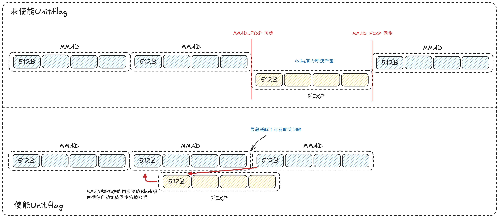

# MXFP4 量化矩阵乘教程：流水分析与分步优化

## 摘要

本文档说明 `matmul_tutorials` 目录内 **MXFP4 量化矩阵乘** Step 样例的组织方式：自 **Step 0 基准** 出发，经各 Step 优化，依次交代各步 **问题背景**、**优化思路** 及与 **Shape**、**硬件流水** 的对照读法。读者可据此选用或排布样例，亦可将同一分析范式迁移至其他 `m×k×n` 组合。

性能建模、Bound 判定与策略取舍的系统性论述，见 [MXFP4 量化矩阵乘算子性能优化指南](../docs/quant_matmul_mxfp4_performance.md)。

---

## 前言

各Step技术章节按 **问题背景 → 优化思路 → 典型 Shape  → 示例 Case 与流水分析 → 代码索引比对** 展开：**问题背景** 说明本节承接的实现及其暴露的矛盾，即前一阶段在给定假设下仍未能消除的瓶颈；**优化思路** 随之给出本节在 **核内缓冲**、**多核排布**、**尾块切分** 或 **指令级同步（如 UnitFlag）** 等维度上的优化要点。其后各节给出与 Shape 相关的定性条件、可复现 `m,k,n` 及 Profiling 对照项。

## 流水与数据流基础

本节给出各Step技术章节共用的 **物理流水视图**。

### 存储层次与数据流

| 层级 | 功能 |
|------|-----------|
| **Global Memory（GM）** | 存放完整 A、B、scaleA、scaleB 及输出 C，各个核共用。 |
| **L1 Buffer** | 位于GM和L0 Buffer之间的一块存储硬件，存放A/B矩阵以及Scale矩阵，各个核独立。 |
| **L0 A/B Buffer** | 位于L1 Buffer和MMAD计算单元之间的一块存储硬件，存放A/B矩阵，各个核独立。 |
| **L0 MX A/B Buffer** | 位于L1 Buffer和MMAD计算单元之间的一块存储硬件，存放Scale A/B矩阵，各个核独立。 |
| **L0C Buffer** | 一块存储硬件，存放MMAD计算单元运算的结果，各个核独立。 |

### 数据搬运组件

| 组件 | 功能 |
|------|------|
| **MTE2** | GM 与 L1 之间的数据搬运。 |
| **MTE1** | L1 与 L0 之间的数据搬运。 |
| **MMAD** | MXFP4 反量化与矩阵乘累加。 |
| **FIXPIPE** | L0C 至 GM 的写回。 |

数据路径可概括为：**GM →（MTE2）→ L1 →（MTE1）→ L0 → MMAD → L0C →（FIXPIPE）→ GM**。

<div align="center">
  
</div>

### 符号与约定

下列记号通篇统一；示例 Case 中的取值须满足 Host 侧校验（见第十章）。

- `baseM`、`baseN`：核在一个round中完成计算的tile块大小。
- `blockNum`：Device 侧的AIC核数。
- `round`：各个核进行计算的轮数，并行计算情况下，一轮中32个核会完成32个tile块的计算，不满32个tile块则仅有部分核参与计算。

---

## 0 基础实现

### 0.1 问题背景

Step 0 承担 **基准** 角色，在尚未引入各优化手段之前，需先固定 **列优先** tile 索引规则与核内 **L1/L0 双 K 循环** 实现。

### 0.2 优化思路

本章节实现mxfp4类型矩阵乘的极简版本， 提供**标准搬运/MMAD 流水与通用列优先 block 调度策略** ，给出可复现参考实现：Host 启动、列优先Block调度、Block内数据搬运时序，构成后续各章的 **对照组**。

### 0.3 典型 Shape 

- 不涉及

### 0.4 示例 Case 与流水分析

**Case_1280_512_1024**  
流水图中展现了数据搬运与计算之间的先后关系，从图中可以看到MMAD的计算依赖MMTE1的搬运、MTE1的搬运依赖MTE2、FIXPIPE的搬运依赖MMAD的计算，构成了一个round中的时序图。
<div align="center">
  
</div>

### 0.5 代码索引比对

- **样例根目录**：[0_naive/](0_naive/)

---

## 1 Double-Buffer

本节为 **核内双缓冲** 主题的 **占位章节**：目录、样例工程与正文说明 **待补充**。原理与流水预期可先参阅《性能优化指南》中 **Double Buffer（双缓冲）** 及示意图（`image33.png`）。

### 1.1 问题背景

*（待补充：承接 Step 0，在何种 K/L1 分段假设下，单缓冲或顺序流水仍导致 MTE2/MTE1/M 之间存在可持续缩短的气泡等。）*

### 1.2 优化思路

*（待补充：双套 L1（及/或 L0）缓冲交替、事件同步与 K 维迭代的衔接要点；与本目录既有 `BlockMmadMx` 中 `l1BufNum` 等配置的关系。）*

### 1.3 典型 Shape 

*（待补充：K 较大、单 tile 内 L1 循环轮数多、或对访存延迟敏感等定性条件。）*

### 1.4 示例 Case 与流水分析

*（待补充：可复现 `m,k,n`；流水图上与 Step 0 的对比观测项。）*

<div align="center">
  
</div>

### 1.5 代码索引比对

- **样例根目录（占位）**：[1_double_buffer/](1_double_buffer/)  
- *（待补充：`block_mmad` / `kernel` 等头文件清单。）*

---

## 3 SWAT 调度优化

### 3.1 问题背景

承接 Step 0（基准为 **列优先** tile 序）：**多核** 侧若仍采用 **简单行/列扫描式** 调度（与 **Step 3** 本节的 SWAT 调度相比），在同一调度轮次内各核所访问的 tile 在 **M–N 平面** 上分布范围较大，影响首轮搬运与计算阶段的衔接。

### 3.2 优化思路

在 **保持与 Step 0 同类 BlockMmad 数据通路**（不改 GM→L1→L0→MMAD 流水）的前提下，仅替换调度侧 **`GetTileIdx`**：引入 **M 向滑动窗口**（如 `WINDOW_LEN=4`）与 **N 向 Z 型** 往复，使同一轮多核对 tile 的访问尽量集中于较规则的 **M–N** 子区域，从而提高 **空间局部性**；同时使 **MTE2** 数据搬运与 **MMAD** 的时间重叠程度更高，从而提高 **Cube** 计算单元利用率。

### 3.3 典型 Shape 

- `mCnt×nCnt` 较大，例如二者均 **不小于 4**，使得多核 **同一轮内** tile 的空间分布对缓存/带宽行为敏感。  
- `k` 适中或偏大，使得单 tile 内核内工作量足以支撑 **MMAD 连续执行**，从而放大首轮搬运准备对性能的影响差异。

### 3.4 示例 Case 与流水分析

**Case_1280_512_4096（多 tile、便于对比行列访问对流水的影响）**  
- Shape：`m=1280, k=512, n=4096`。  
- 在 `baseM=baseN=256` 下，`totalCnt=5×16=80`。  


<div align="center">
  
</div>


### 3.5 代码索引比对

- **样例根目录**：[3_block_swat/](3_block_swat/)

---

## 4 尾轮 tile 负载均衡

### 4.1 问题背景

在 **Step 3** 中，我们对 block 的调度进行了优化。但注意到，由于 **单个 tile 大小** 在调度阶段确定（`baseM×baseN`及边界 `tailM`/`tailN`），固定的切分策略下，**尾轮** 容易出现 tile 块个数小于 `blockNum` 核数的情况，在此场景下，若各 tile 仍作为单块分配至不同核，则尾轮可参与的核数会小于 `blockNum`，部分核无法参与计算，导致尾轮吞吐量下降，对于此种情况，我们需要考虑一种新的切分策略。

<div align="center">
  
</div>

### 4.2 优化思路

在 **沿用 Step 3 式多核排布**（或同类 SWAT 调度）的前提下，对尾轮 tile 块实施 **`mTailTile×nTailTile` 二次切分**，如图所示，减小尾轮 tile 块大小，从而增加尾轮 tile 块数量，分配到更多的核上计算，**提高并行度**。

<div align="center">
  
</div>

### 4.3 典型 Shape 

- 尾轮 **待处理 tile 数** 显著小于 `blockNum`，例如 32 核下尾轮仅有 4 个 tile 块，通常保证二次切分后新 tile 数量可增至接近核数。 

### 4.4 示例 Case 与流水分析

**Case_1280_512_4096（多 tile、便于对比行列访问对流水的影响）**  
- Shape：`m=1280, k=512, n=4096`。  
- 在 `baseM=baseN=256` 下，`totalCnt=5×16=80`。  
- 若 `blockNum=32`，则 `round=3`：**尾轮余 16 个 tile**，每个tile**大小为（256， 256）**，如果无尾轮负载均衡，则出现16个核计算，16个核空闲的情况，而在尾轮负载均衡情况下（当前固定n方向切分成2块），则**剩余的16个tile**被切分为**32个tile**，每个**tile大小为（256, 128）**。  
- **流水关注点**：**Step 4** 引入尾块子划分后，尾轮 **并行 MMAD 实例数与耗时** 的变化。

从下图中可以看出，在对尾轮tile块进行拆分后，对比拆分前，尾轮tile块计算的耗时显著减少

<div align="center">
  
</div>

### 4.5 代码索引比对

- **样例根目录**：[4_last_round_tile_balance/](4_last_round_tile_balance/)

---

## 5 UnitFlag 优化

### 5.1 问题背景

未开启 **UnitFlag** 时，**`FIXPIPE` 须待 `MMAD` 指令全部执行完毕后才能开始将 `L0C` 结果搬出**。因此 **`MMAD` 整段计算** 与 **`FIXPIPE` 搬出** 之间是 **整段完成依赖**：须先满足 **全量 `MMAD` 结束** 这一条件，`FIXPIPE` 方可启动。在 **无法用 L0C Double Buffer** 等机制缓冲、掩盖该依赖时，**`FIXPIPE` 在 `MMAD` 运行期间处于等待**，**两段流水难以时间重叠**，造成性能损失，如图所示。

<div align="center">
  
</div>

### 5.2 优化思路

**UnitFlag** 为 **`MMAD` 计算指令** 与 **`FIXPIPE` 数据搬运指令** 提供基于内存访问的 **细粒度同步（512B 粒度）**。开启后，`MMAD` **每计算完 512B 数据**，`FIXPIPE` **即可搬出对应数据块**，从而在 **无法开启 L0C Double-Buffer** 的条件下 **提高计算与搬出流水的并行度**。

<div align="center">
  
</div>

### 5.3 典型 Shape 

本节不绑定具体 `m,k,n` 数值。

### 5.4 示例 Case 与流水分析

在下图中，相邻基本块的MMAD指令不再强制等待FIXPIPE，一定程度上提高了流水并行度
<div align="center">
  
</div>

### 5.5 代码索引比对

- **样例根目录**：[5_unit_flag/](5_unit_flag/)

---

## 依赖与构建

- 运行与编译依赖 **CANN** 工具链及工程内 CMake 所启用的 AscendC/AOT 选项，具体以仓库根目录及 [matmul_story/CMakeLists.txt](../CMakeLists.txt) 为准。  
- 各 Step 可执行文件在父级 `CMakeLists.txt` 中通过 `add_matmul_tutorial(...)` 声明（`0_naive`、`3_block_swat`、`4_last_round_tile_balance`、`5_unit_flag`），本目录下不再单独放置子 `CMakeLists.txt`。

**生成的可执行文件名**：

- `matmul_tutorial_mxfp4_base`  
- *（待补充）*  
- `matmul_tutorial_mxfp4_swat`  
- `matmul_tutorial_mxfp4_swat_balance`  
- `matmul_tutorial_mxfp4_swat_unitflag`

---

## 运行与校验

```text
./matmul_tutorial_mxfp4_base <m> <k> <n>
./matmul_tutorial_mxfp4_swat <m> <k> <n>
./matmul_tutorial_mxfp4_swat_balance <m> <k> <n>
./matmul_tutorial_mxfp4_swat_unitflag <m> <k> <n>
```

**输入合法性**：`m,k,n` 均为正整数；`k` 为偶数；须满足 `CeilDiv(k, 32) % 2 == 0`。

**数据与 golden**：程序从 `./input/` 读取 `input_a.bin`、`input_b.bin`、`input_scaleA.bin`、`input_scaleB.bin`；结果写入 `./output/npu_out.bin`；数值比对可参阅 `common/golden/quant_matmul_mxfp4/verify_result.py`。

---

## 目录结构

```text
matmul_tutorials/
├── README.md
├── 0_naive/
│   ├── matmul_tutorial_mxfp4_base.cpp
│   └── include/
├── 1_double_buffer/          # Step 1，工程与源码待落地
│   └── …
├── 3_block_swat/
│   ├── matmul_tutorial_mxfp4_swat.cpp
│   └── include/
├── 4_last_round_tile_balance/
│   ├── matmul_tutorial_mxfp4_swat_balance.cpp
│   └── include/
└── 5_unit_flag/
    ├── matmul_tutorial_mxfp4_swat_unitflag.cpp
    └── include/
```
